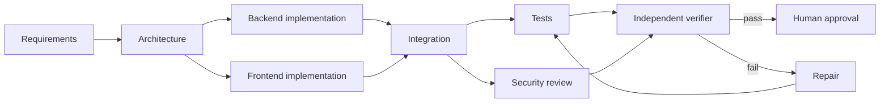
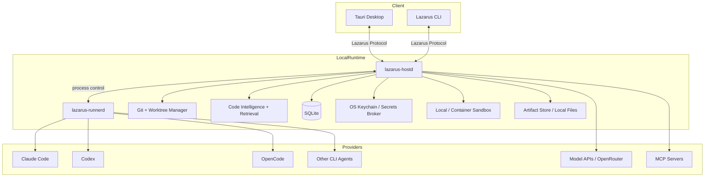

# LAZARUS INITIAL Build Plan

> **Project name:** Lazarus  
> **Product category:** Local-first, multi-agent, spec-driven software engineering orchestration platform  
> **Target:** A complete Traycer-like application implemented independently from scratch, with all core execution, orchestration, context, artifacts, verification, security, integrations, and persistence running locally on the user's machine. Lazarus-hosted cloud, collaboration, cross-device sync, PWA control, and future remote execution are deliberately deferred.
> **Document status:** Final local-first implementation blueprint. This is the complete current build scope, not an MVP-only plan. Cloud/distributed features are explicitly excluded from the active roadmap and can be added later through preserved extension seams.
> **Prepared:** 2026-08-23  
> **Review:** Cross-checked against Traycer's public GitHub repository, public documentation index, development guide, and currently documented Desktop/agent architecture on 2026-08-23.  
> **Implementation principle:** Build Lazarus independently. Reproduce useful product *capabilities and workflows*, not Traycer's private Host/backend implementation, proprietary prompts, branding, or protected UI assets.

---

## 0. What Lazarus Is

Lazarus is a **desktop-first, local-first agentic software-development control plane**. It sits above coding agents such as Claude Code, Codex, OpenCode, Gemini/Qwen/Kimi-style CLIs, and API-backed models. The Lazarus Desktop, local Host, process supervisor, SQLite database, Git/worktree engine, context index, artifact system, orchestration engine, verification engine, permissions, and audit history all run on the user's computer.

The current product does **not** require or implement a Lazarus cloud backend.

The core product loop is:

```text
Intent
  -> Gather local repository context
  -> Clarify requirements
  -> Produce durable local specs/artifacts
  -> Decompose into executable work
  -> Route work to one or more configured coding agents
  -> Run write agents in isolated local worktrees/containers
  -> Observe tools/files/tests/diffs
  -> Verify against requirements + deterministic gates
  -> Repair failures within explicit limits
  -> Human approval / local Git integration / optional PR creation
  -> Preserve task knowledge locally for future work
```

The active Lazarus product should match the useful **local** concepts visible in Traycer—durable Tasks, agents, worktrees, artifacts, Chat/Terminal surfaces, multi-provider support, agent-to-agent coordination, planning, review, verification, Git workflows, and CLI control—while owning the implementation independently.

### Current scope boundary

**Build now:**

- Tauri desktop application;
- local `lazarus-hostd`;
- local `lazarus-runnerd`;
- local SQLite persistence;
- workspace/repository management;
- Git/worktree management;
- local/container execution;
- Chat agents and Terminal agents;
- provider/model adapters;
- canonical context and provider switching;
- local code indexing/retrieval;
- Specs/Tickets/Stories/Reviews/ADRs;
- multi-agent DAG orchestration;
- durable local agent mailboxes;
- deterministic + AI verification;
- repair loops;
- diff/review/integration UI;
- MCP/tools/skills;
- local secrets broker and permissions;
- local audit/observability;
- optional direct integrations with GitHub/GitLab/Jira/Linear;
- CLI parity;
- signed desktop/Host releases;
- export/import/backup/recovery.

**Explicitly defer:**

- Lazarus accounts;
- organizations/teams;
- Lazarus cloud API/control plane;
- PostgreSQL/Redis/NATS/object storage services;
- collaboration/presence/comments shared across users;
- CRDT sync;
- cross-device Task sync;
- browser/PWA client;
- future remote execution;
- remote job control;
- cloud-hosted telemetry;
- SaaS billing;
- enterprise SSO/SCIM;
- self-hosted Lazarus cloud.

Do not build placeholder cloud services. Preserve stable IDs, versioned protocols, versioned exports, and clean domain boundaries so distributed features can be added later without rewriting the local core.

### Public Traycer behavior used as product research

Traycer's public materials were used only to understand product behavior and terminology. Lazarus should reproduce equivalent useful capabilities independently, not copy private Host/backend implementation details, proprietary prompts, branding, or protected UI assets.

For the **current local-first Lazarus scope**, Traycer's collaboration, cross-device, and cloud-backed behavior is intentionally not a parity requirement.

Reference material retained from the original research:

- https://github.com/traycerai/traycer
- https://github.com/traycerai/traycer/blob/main/README.md
- https://github.com/traycerai/traycer/blob/main/AGENTS.md
- https://github.com/traycerai/traycer/blob/main/docs/DEVELOPMENT.md
- https://docs.traycer.ai/llms.txt
- https://docs.traycer.ai/concepts/tasks-and-workspace-folders
- https://docs.traycer.ai/concepts/agent-to-agent
- https://docs.traycer.ai/concepts/worktrees
- https://docs.traycer.ai/concepts/hosts
- https://docs.traycer.ai/panels/agents
- https://docs.traycer.ai/panels/artifacts
- https://docs.traycer.ai/agents-and-models/coding-agents
- https://www.npmjs.com/package/@traycerai/cli

---

## 0.1 Local-First Architecture Corrections

The previous plan remains the architectural basis, with these rules now made explicit:

1. **One-machine authority.** For the current product, the local Host is authoritative for Task, Agent, Artifact, Workflow, Verification, and integration state.
2. **No cloud dependency.** Starting, planning, running, verifying, reviewing, and restoring Tasks must work without a Lazarus account or Lazarus server.
3. **Worktree != sandbox.** Worktrees isolate Git changes; containers/OS sandbox mechanisms provide stronger execution isolation.
4. **Separate `hostd` and `runnerd`.** Host restarts/updates should not unnecessarily terminate compatible PTYs or agent processes.
5. **Provider-neutral core.** Provider-specific behavior remains inside adapters/provider packs.
6. **Canonical local history.** Lazarus owns durable canonical messages/checkpoints; provider-private sessions are only optimizations.
7. **A2A is local and durable.** Mailboxes are persisted locally and delivery depends on agent capabilities.
8. **Trust-aware context.** Repository/tool/external content is data and cannot override user/security policy.
9. **Secret + egress controls remain separate.**
10. **All artifacts/export formats are versioned now** so future sync can replicate them later.
11. **Stable UUIDv7 IDs are retained** even though the system is single-machine today.
12. **Protocol boundaries remain real.** Desktop and CLI still communicate with Host through a versioned protocol rather than in-process UI state.
13. **Storage lifecycle is part of 1.0.** Local-only does not mean unbounded caches/logs/worktrees.
14. **Vertical slices remain mandatory.** Reliability and verification come before broad autonomy.
15. **Do not pre-build distributed abstractions that have no current user value.** Add only small, documented seams needed to avoid future lock-in.

### 0.2 Future compatibility without building cloud now

To make later cloud support practical, the local version must preserve:

```text
stable entity IDs
append-only event identifiers
artifact revisions
canonical timestamps
explicit ownership fields where actually needed
idempotent local mutation IDs where cheap
versioned protocol schemas
versioned export formats
provider-neutral context
secrets outside portable data
clean Host API boundaries
```

That is enough preparation. Do **not** add sync queues, CRDTs, cloud databases, remote-runner leases, account models, or distributed consensus logic until that future product phase begins.

---

# 1. End-State Product Goals

The **current local-first Lazarus product is complete** when a developer can:

1. Install one Lazarus desktop package on Windows, macOS, or Linux.
2. Use Lazarus without creating a Lazarus account.
3. Open one or multiple local Git repositories.
4. Create a Task from free text, selected files/diffs/images, local specs, or an optionally imported issue.
5. Index large repositories incrementally without exhausting CPU/RAM.
6. Generate Quick Plans, detailed Plans, Phases, Epics, Reviews, and bounded Autopilot workflows.
7. Store goals, requirements, decisions, tickets, reviews, and evidence as durable local artifacts.
8. Launch one or many coding agents.
9. Use different providers/models for exploration, planning, implementation, testing, debugging, security review, and final review.
10. Switch providers while preserving Lazarus-owned canonical context.
11. Run write-capable agents in separate Git worktrees by default.
12. Optionally run agents inside local containers for stronger isolation.
13. Let agents spawn children, send durable local messages, request reviews, and hand off work where provider capabilities permit.
14. Observe agent state, terminal activity, tool calls, file changes, diffs, usage/cost, permissions, and evidence live.
15. Stop, resume, retry, fork, or rewind from Lazarus checkpoints.
16. Run deterministic format/lint/typecheck/test/security gates.
17. Run independent AI-based requirement/spec review.
18. Automatically repair failures within configured iteration/time/token/cost limits.
19. Review attributed diffs and evidence before accepting changes.
20. Commit, merge, rebase, cherry-pick, export a patch, or optionally create a PR.
21. Use the full core workflow from the CLI without the GUI.
22. Install/configure MCP servers, skills, workflows, and provider packs locally.
23. Inspect, export, back up, restore, and delete all Lazarus-owned data.
24. Recover cleanly from Desktop crashes, Host restarts, provider crashes, interrupted updates, and machine restarts.
25. Diagnose configuration/runtime failures with `lazarus doctor`.
26. Run the whole core product while Lazarus's own servers do not exist.

### Explicit non-goals for the current build

The following are **not requirements for local 1.0**:

- multi-user collaboration;
- cross-device continuation;
- browser/PWA control;
- future remote execution;
- Lazarus cloud storage;
- organization administration;
- enterprise identity;
- SaaS billing;
- shared team audit/control planes.

These are future expansion areas, not missing implementation tasks.

---

# 2. What Lazarus Should Improve

## 2.1 Capability target for the local release

| Area | Traycer-like baseline | Lazarus local-first end state |
|---|---|---|
| Local Host | Separate Host runtime | Fully open-source local Host with reproducible builds |
| Desktop | Cross-platform | Cross-platform Tauri desktop |
| Provider integrations | Multiple coding agents | Versioned provider-pack SDK for CLI and API agents |
| Model switching | Shared context | Provider-neutral canonical context ledger + checkpoints |
| Worktrees | Git worktrees | Worktrees + local containers + collision detection |
| Multi-agent | Parent/child + messaging | Durable local mailboxes, DAGs, leases, routing, budgets |
| Planning | Plans/phases/epics | Quick/Plan/Phases/Epic/Review/Autopilot workflows |
| Verification | AI verification | Deterministic evidence gates + independent reviewers + bounded repair |
| Artifacts | Specs/tickets/stories/reviews | Versioned typed local artifacts + relations + traceability |
| Context | Shared context | Hybrid retrieval + symbol graph + context budgeting + provenance |
| Cost visibility | Usage/rate information | Per-agent/per-task budget, provider price catalog, forecasts, alerts |
| Reliability | Host lifecycle | `hostd`/`runnerd`, checkpoints, resumable updates, watchdogs, crash recovery |
| Security | Provider + Host security | Capability policy, containers, secrets broker, audit log, signed plugins |
| Extensibility | MCP/custom agents | MCP + provider SDK + workflow SDK + skills/tool packages |
| Automation | Autonomous mode | Policy-governed DAG execution with stop conditions and escalation |
| Git workflow | Branch/diff/review | Attributed diffs, integration evidence, local commits, optional PR automation |
| Data ownership | Product-managed data | Local SQLite + open Markdown/export formats + backups |
| CI | Local app workflow | Headless local CI/reviewer mode and GitHub Actions-compatible CLI |

## 2.2 Non-negotiable differentiators

Implement these as primitives:

- **Local ownership:** no Lazarus account/server is required.
- **Durability:** meaningful transitions persist before acknowledgement.
- **Provider neutrality:** core domain logic does not branch on provider names.
- **Change isolation:** parallel write agents use separate worktrees.
- **Security honesty:** policy-only runs are not labeled sandboxed.
- **Evidence-based completion:** “agent says done” is never enough.
- **Explicit permissions:** shell/network/filesystem/tool/secret capabilities are visible and auditable.
- **Resumability:** Desktop, Host, sessions, workflows, and updates survive interruption.
- **Open data:** Tasks/artifacts/evidence can be exported in documented formats.
- **Protocol compatibility:** Desktop, CLI, Host, and runner supervisor may upgrade independently within declared ranges.
- **Inspectable autonomy:** users can see why work is running, blocked, retried, or complete.
- **Bounded resource use:** indexing, logs, worktrees, containers, and histories have limits.
- **Future-ready but not future-built:** distributed features can be layered on later without contaminating today's local runtime.

---

# 3. Product Modes

Do not create completely separate engines for each mode. All modes should compile into the same internal `WorkflowGraph`.

## 3.1 Quick Mode

Use for small tasks.

Flow:

```text
query -> context gather -> one compact plan -> one agent -> gates -> review
```

Rules:

- avoid artifact bureaucracy unless requested;
- one write-capable agent by default;
- context budget is small;
- deterministic verification still applies.

## 3.2 Plan Mode

For a normal single-PR feature or bug fix.

Outputs:

- problem statement;
- assumptions;
- impacted files/symbols;
- ordered implementation steps;
- tests;
- risks;
- acceptance criteria;
- optional Mermaid architecture/sequence diagram.

Execution can be manual or delegated.

## 3.3 Phases Mode

For multi-step changes where checkpoints matter.

State machine:

```text
DISCOVERY
  -> REQUIREMENTS
  -> PROPOSE_PHASES
  -> PHASE_READY
  -> IMPLEMENTING
  -> VERIFYING
  -> PHASE_APPROVED
  -> NEXT_PHASE
  -> FINAL_REVIEW
  -> COMPLETE
```

Each phase carries:

- goal;
- dependencies;
- file/symbol scope;
- implementation plan;
- verification contract;
- output summary;
- commits;
- lessons/context for later phases.

## 3.4 Epic Mode

Epic is the durable planning workspace.

Typed artifact hierarchy:

```text
Epic
├── Product Spec
├── Architecture Spec
├── UX Spec
├── Story
│   ├── Ticket
│   └── Ticket
├── Story
│   └── Ticket
├── Review
└── Decision Records
```

Epic supports:

- requirement capture;
- spec authoring;
- architecture planning;
- ticket decomposition;
- dependency graph;
- ticket assignment to humans or agents;
- board view;
- comments;
- cross-artifact validation;
- traceability;
- execution of one ticket, one story, or whole Epic.

## 3.5 Review Mode

Inputs:

- current branch vs base;
- uncommitted changes;
- selected commit range;
- PR;
- selected files.

Review pipeline:

1. structural diff scan;
2. dependency/symbol impact analysis;
3. tests and static analysis;
4. correctness reviewer;
5. security reviewer when relevant;
6. performance reviewer when relevant;
7. spec/acceptance compliance;
8. severity-ranked findings;
9. evidence and location for every finding;
10. optional automated fix task.

## 3.6 Autopilot Mode

Autopilot compiles a Task into a DAG.

Example:



Hard controls:

- maximum agents;
- maximum concurrent agents;
- max elapsed runtime;
- max tool calls;
- max token/currency budget;
- max repair loops;
- allowed providers/models;
- allowed directories;
- network policy;
- shell command policy;
- PR/merge policy;
- human-approval gates.

---

# 4. Architecture

## 4.1 Current local topology



There is no Lazarus cloud process in the current topology.

## 4.2 Process boundaries

### Desktop shell

Responsibilities:

- install/update/supervise local Host components;
- OS integration;
- secure deep links/OAuth callbacks for optional third-party integrations;
- notifications;
- app menus;
- auto-update;
- window management;
- protocol connection bootstrap.

It does **not** own durable Task/Agent/Artifact state.

### `lazarus-hostd`

The local source of truth.

Responsibilities:

- workspace registry;
- Task/Agent/Artifact persistence;
- file operations;
- Git/worktree operations;
- provider adapters;
- context indexing/retrieval;
- workflow engine;
- verification engine;
- permissions;
- MCP/tool execution;
- usage/cost ledger;
- local audit trail;
- local API/protocol;
- crash recovery;
- third-party integration clients.

### `lazarus-runnerd`

Small local process supervisor.

Responsibilities:

- PTY/ConPTY ownership;
- coding-agent CLI child processes;
- process groups / Windows Job Objects;
- stdout/stderr/PTY framing;
- signal/cancellation handling;
- process resource accounting;
- bounded transcript spool/replay;
- process reconciliation after Host restart.

It does **not** own Task truth, planning, provider routing, or artifact state.

## 4.3 Local authority model

For current Lazarus:

```text
SQLite + append-only local events
        ^
        |
    lazarus-hostd
        ^
        |
 Desktop / CLI
```

Rules:

- one local Host is authoritative for a Lazarus data directory;
- write RPCs are transactional/idempotent where needed;
- finalized message/artifact/workflow boundaries are durable;
- Desktop cache is disposable;
- runner processes are reconciled against Host state after restart;
- no distributed clocks, remote leases, cloud conflict resolution, or CRDT convergence are needed.

## 4.4 Local IPC

Preferred transport:

1. Unix domain socket on macOS/Linux;
2. Windows named pipe on Windows;
3. authenticated loopback HTTP/WebSocket only where required.

If loopback transport exists:

- bind to loopback only;
- high-entropy per-install/session credentials;
- strict `Origin` validation;
- bounded frames/messages;
- rate limits;
- no unauthenticated discovery;
- never accept workspace paths before authentication.

## 4.5 Future extension seam

A later distributed edition may add a separate sync/control service, but it must consume the same versioned Host/domain contracts. The local Host must not depend on that future service to function.

---

# 5. Recommended Technology Stack

## 5.1 Repository/tooling

Use a polyglot monorepo:

- **pnpm** workspace;
- **Node 24 LTS**;
- **Nx** for TypeScript task orchestration;
- Cargo workspace for Rust;
- Buf/Protobuf for protocol schemas;
- generated Rust/TypeScript protocol bindings;
- Prettier/ESLint + rustfmt/clippy;
- GitHub Actions for CI.

## 5.2 Desktop UI

- Tauri 2
- React 19
- TypeScript strict mode
- Vite
- TanStack Router
- TanStack Query
- Zustand for transient UI state only
- Tailwind CSS
- shadcn/ui or Radix primitives
- xterm.js
- CodeMirror 6
- TipTap or a Markdown-first structured editor for artifacts
- Mermaid
- Vitest + Testing Library + Playwright

Avoid introducing CRDT libraries in the current local build. Artifact revisioning is local and explicit.

## 5.3 Local Host

Rust:

- Tokio
- Axum or local RPC transport glue where appropriate
- serde
- prost / tonic-generated types
- sqlx + SQLite
- portable-pty / platform PTY abstractions
- notify
- system `git` for authoritative Git/worktree operations
- git2 only for safe structured reads if useful
- tracing + OpenTelemetry APIs with local exporters
- keyring
- reqwest
- rustls/ring/age where cryptography is needed
- tree-sitter parsers
- Tantivy or SQLite FTS5
- sqlite-vec or a small embedded vector engine if semantic retrieval is enabled

## 5.4 Process supervisor

Rust `lazarus-runnerd`:

- Tokio
- PTY/ConPTY support
- process groups / Windows Job Objects
- local authenticated IPC
- bounded spool files
- resource counters
- graceful drain/reconcile protocol

Keep it deliberately small.

## 5.5 Local isolation

Implement in this order:

1. worktrees for change isolation;
2. Docker containers for stronger local isolation;
3. Podman compatibility;
4. optional OS-specific restricted profiles where practical.

No remote runner is part of the current build.

## 5.6 Local storage

Primary:

- SQLite WAL mode for metadata/events;
- local filesystem for caches, exports, backups, diagnostic bundles, and optional large blobs;
- OS keychain for credentials.

Do not run PostgreSQL, Redis, NATS, MinIO/S3, or another database/service for the current product.

## 5.7 Development environment

Use only what the local product needs:

- Rust toolchain
- Node/pnpm
- Tauri prerequisites
- Docker/Podman only for container execution tests
- fake provider binaries/harnesses
- local OpenTelemetry collector only when useful for development

The normal end user should not need Docker unless they choose container-isolated execution.

---

# 6. Monorepo Layout

```text
lazarus/
├── apps/
│   ├── desktop/                  # Tauri + React desktop
│   └── docs-site/                # static documentation, optional
├── packages/
│   ├── ui/
│   ├── app-core/
│   ├── protocol-ts/
│   ├── workflow-sdk/
│   ├── provider-sdk/
│   ├── artifact-sdk/
│   ├── config/
│   └── test-fixtures/
├── crates/
│   ├── host/                     # lazarus-hostd
│   ├── runnerd/                  # PTY/process supervisor
│   ├── cli/
│   ├── protocol-rs/
│   ├── workspace/
│   ├── git-engine/
│   ├── worktree/
│   ├── terminal/
│   ├── process-supervisor/
│   ├── providers/
│   ├── orchestration/
│   ├── context-engine/
│   ├── code-index/
│   ├── artifacts/
│   ├── verification/
│   ├── mcp/
│   ├── permissions/
│   ├── secrets/
│   ├── persistence/
│   ├── integrations/
│   ├── telemetry/
│   └── updater/
├── provider-packs/
│   ├── opencode/
│   ├── codex/
│   ├── claude-code/
│   └── generic-cli/
├── proto/
│   ├── common.proto
│   ├── handshake.proto
│   ├── workspace.proto
│   ├── task.proto
│   ├── agent.proto
│   ├── terminal.proto
│   ├── git.proto
│   ├── artifact.proto
│   ├── workflow.proto
│   ├── verification.proto
│   ├── provider.proto
│   ├── permissions.proto
│   └── integration.proto
├── docs/
│   ├── architecture/
│   ├── adr/
│   ├── protocol/
│   ├── security/
│   ├── runbooks/
│   └── product/
├── scripts/
├── .github/workflows/
├── Cargo.toml
├── nx.json
├── pnpm-workspace.yaml
├── package.json
└── README.md
```

Do not create `services/`, Kubernetes manifests, Terraform, web/PWA apps, sync packages, or cloud infrastructure directories in the current repository.

---

# 7. Core Domain Model

Use stable UUIDv7 IDs.

## 7.1 Entities

### Host

```text
Host
- id
- name
- protocol_version
- host_version
- capabilities[]
- connectivity_status
- last_seen_at
```

### Workspace

```text
Workspace
- id
- host_id
- canonical_path
- display_name
- vcs_type
- repo_remote_url?
- repo_fingerprint?
- settings
```

### Task

```text
Task
- id
- title
- description
- mode
- status
- created_at
- updated_at
- archived_at?
```

### TaskWorkspace

```text
TaskWorkspace
- task_id
- workspace_id
- default_run_location
- base_ref
```

### Agent

```text
Agent
- id
- task_id
- parent_agent_id?
- parent_artifact_id?
- display_name
- interface_type       # CHAT | TERMINAL
- provider_id
- model_id?
- status
- host_id
- workspace_id?
- worktree_id?
- upstream_session_id?
- permission_profile_id
- created_at
- updated_at
```

### AgentRun

One agent may have many turns/runs.

```text
AgentRun
- id
- agent_id
- run_number
- provider_id
- model_id
- reasoning_effort?
- started_at
- ended_at?
- status
- stop_reason?
- usage_json
- error_json?
```

### AgentEvent

Append-only event ledger.

```text
AgentEvent
- seq
- task_id
- agent_id
- run_id?
- event_type
- payload
- created_at
- checksum
```

Examples:

- `USER_MESSAGE`
- `ASSISTANT_DELTA`
- `ASSISTANT_MESSAGE`
- `TOOL_CALL_STARTED`
- `TOOL_CALL_FINISHED`
- `FILE_READ`
- `FILE_WRITTEN`
- `SHELL_COMMAND_STARTED`
- `SHELL_COMMAND_FINISHED`
- `CHILD_AGENT_CREATED`
- `AGENT_MESSAGE_SENT`
- `AGENT_MESSAGE_RECEIVED`
- `CHECKPOINT_CREATED`
- `RUN_STOPPED`
- `USAGE_RECORDED`

### Artifact

```text
Artifact
- id
- task_id
- parent_id?
- type             # SPEC/TICKET/STORY/REVIEW/ADR/PLAN/CUSTOM
- title
- status?
- assignee_type?
- assignee_id?
- content_doc_id
- created_by
- created_at
- updated_at
```

### ArtifactRevision

```text
ArtifactRevision
- id
- artifact_id
- revision
- content_hash
- markdown_snapshot
- author_type
- author_id
- created_at
```

### ArtifactRelation

```text
ArtifactRelation
- from_artifact_id
- relation_type      # DEPENDS_ON/BLOCKS/IMPLEMENTS/VERIFIES/DERIVED_FROM
- to_artifact_id
```

### Worktree

```text
Worktree
- id
- workspace_id
- host_id
- path
- branch
- base_ref
- status
- owner_agent_id?
- created_at
- last_used_at
```

### Workflow

```text
WorkflowDefinition
- id
- name
- version
- graph_json
- policy_json
```

### WorkflowRun

```text
WorkflowRun
- id
- task_id
- definition_id
- definition_version
- state
- created_at
- updated_at
```

### WorkflowNodeRun

```text
WorkflowNodeRun
- id
- workflow_run_id
- node_id
- attempt
- agent_id?
- status
- inputs_json
- outputs_json
- evidence_json
```

### VerificationRun

```text
VerificationRun
- id
- task_id
- agent_id?
- artifact_id?
- target_ref
- status
- summary
- started_at
- finished_at
```

### Finding

```text
Finding
- id
- verification_run_id
- severity
- category
- file_path?
- line_start?
- line_end?
- message
- evidence
- proposed_fix?
- status
```

---

# 8. Local Persistence

Use SQLite in WAL mode.

Suggested tables:

```text
meta
migrations
hosts
workspaces
tasks
task_workspaces
agents
agent_runs
agent_events
agent_messages
artifacts
artifact_revisions
artifact_relations
terminals
terminal_checkpoints
worktrees
workflow_definitions
workflow_runs
workflow_node_runs
verification_runs
findings
provider_profiles
permission_profiles
context_documents
context_chunks
symbol_nodes
symbol_edges
file_index_state
audit_events
```

Rules:

1. Every state transition must be transactional.
2. Agent output streaming can be buffered, but finalized message boundaries must be durable.
3. Use append-only events for agent/workflow history and materialized tables for fast UI.
4. Use explicit schema migrations.
5. Before any destructive migration, create a compact backup.
6. Include DB integrity checks in `lazarus doctor`.
7. Never write API keys into SQLite.

---

# 9. Lazarus Protocol

## 9.1 Goals

- Desktop, CLI, Host, and runner supervisor evolve independently within declared compatibility ranges.
- Strongly typed.
- Supports unary RPC and streaming.
- Capability negotiation.
- Backward-compatible within a major version.
- Request cancellation.
- Reconnect and resume.
- Idempotency for write RPCs.

## 9.2 Handshake

Client sends:

```json
{
  "client": "desktop",
  "client_version": "1.7.0",
  "protocol": {"major": 3, "minor": 4},
  "supported_features": [
    "agent_stream_v2",
    "artifact_revision_v1",
    "pty_resume_v1"
  ],
  "auth": {"kind": "local_token", "token": "..."}
}
```

Host replies:

```json
{
  "host_version": "1.8.2",
  "protocol": {"major": 3, "minor": 6},
  "negotiated_minor": 4,
  "capabilities": {
    "containers": true,
    "remote_runner": true,
    "gpu": false,
    "pty": true
  }
}
```

## 9.3 Envelope

All frames include:

```text
message_id
correlation_id?
stream_id?
sequence?
timestamp
payload_type
payload
```

Streaming guarantees:

- per-stream ordered sequence;
- reconnect from last acknowledged sequence;
- bounded replay window;
- explicit `STREAM_GAP` when replay is impossible.

## 9.4 Versioning rules

- Major change = incompatible wire behavior.
- Minor change = additive fields/methods.
- Every RPC declares minimum protocol minor.
- Unknown fields ignored.
- Never reuse removed field numbers.
- Keep persistence schema versioning separate from wire protocol versioning.

## 9.5 Security

Local:

- Host listens only on loopback by default.
- Random bootstrap token stored with user-only permissions.
- Optional Noise XX session encryption even on loopback.
- Desktop validates Host identity.

Additional local transport controls:

- authenticated named pipe/domain socket preferred;
- loopback HTTP/WebSocket requires Origin validation;
- short-lived connection/session tokens where applicable;
- Desktop validates Host installation identity/version;
- local API never listens on LAN interfaces by default.

---

# 10. Host Lifecycle and Updater

This must be excellent because Host startup failure makes the entire product feel broken.

## 10.1 Installation

Desktop ships a minimal bootstrapper.

Bootstrap algorithm:

1. detect platform/arch;
2. read signed release manifest;
3. choose compatible Host version;
4. check local cache;
5. download with HTTP Range support;
6. persist partial download metadata;
7. resume interrupted download;
8. verify SHA-256;
9. verify Minisign/Cosign signature;
10. atomically unpack to versioned directory;
11. switch `current` pointer;
12. launch Host;
13. health check;
14. rollback to prior Host if health check fails.

## 10.2 Directory layout

```text
~/.lazarus/
  host/
    versions/
      1.8.1/
      1.8.2/
    current
    downloads/
  state/
  logs/
  cache/
  plugins/
  auth/
  backups/
```

## 10.3 Service management

Support:

- macOS launchd;
- Linux systemd user unit;
- Windows user service or background startup task.

CLI:

```bash
lazarus host install
lazarus host ensure
lazarus host start
lazarus host stop
lazarus host restart
lazarus host status
lazarus host update
lazarus host rollback
lazarus host logs --tail 200
lazarus host doctor
```

---

# 11. Workspace and Git Engine

## 11.1 Workspace registration

When a directory is opened:

1. canonicalize path;
2. detect Git repository;
3. find repo root;
4. read remotes;
5. calculate repository fingerprint;
6. detect submodules;
7. detect worktrees;
8. detect project language/toolchain;
9. detect repo instructions:
   - `AGENTS.md`
   - `CLAUDE.md`
   - `CONTRIBUTING.md`
   - `.github/copilot-instructions.md`
   - Lazarus instructions;
10. initialize index.

## 11.2 Worktree manager

Commands:

```bash
lazarus worktree list
lazarus worktree create --workspace <id> --branch lazarus/task-123/backend
lazarus worktree remove <id>
lazarus worktree prune
lazarus worktree repair <id>
```

Creation:

1. acquire repo lock;
2. `git fetch` optionally;
3. validate base ref;
4. generate unique branch name;
5. ensure target directory is empty/nonexistent;
6. create worktree;
7. run user-configured setup hooks;
8. copy safe untracked templates only if policy permits;
9. detect environment files;
10. mark worktree ready.

## 11.3 Collision management

Before parallel agents start:

- estimate file/symbol scopes;
- detect predicted overlap;
- warn if two write agents target same files;
- optionally serialize overlapping nodes;
- detect actual concurrent modifications;
- maintain path leases for high-risk files;
- never silently merge conflicting work.

## 11.4 Integration

Support:

- cherry-pick;
- merge;
- rebase;
- patch apply;
- selective file adoption.

Every integration produces:

```text
IntegrationEvidence
- source agent
- source worktree
- source commit(s)
- target branch
- conflict status
- tests run after integration
```

---

# 12. Execution Isolation

Offer four run locations.

## 12.1 Local

Agent uses the user's working tree directly.

Use only when:

- user selects it;
- one write-capable agent;
- user understands changes are immediate.

## 12.2 Worktree

Default for write agents.

Good balance of speed and isolation.

## 12.3 Container

Container execution profiles:

```yaml
name: node-default
image: ghcr.io/lazarus/base-node:24
workspace_mount: rw
network: restricted
cpu: 4
memory: 8GiB
timeout: 2h
secrets:
  - github_token
```

Implement Docker first, Podman second.

## 12.4 Security-boundary matrix

**A worktree is not a sandbox.** It isolates Git changes, not operating-system capabilities.

| Run location | Prevents Git collision | Filesystem isolation | Network isolation | Secret isolation | Suitable for untrusted autonomous code |
|---|---:|---:|---:|---:|---:|
| Local working tree | No | No | No | Policy only | No |
| Local worktree | Yes | No | No | Policy only | No |
| OS sandbox profile | Yes | Partial/strong depending on OS | Partial/strong | Scoped | Maybe |
| Container | Yes | Strong if configured correctly | Strong if configured | Scoped | Yes |

### Enforcement strategy

Implement security in layers:

- **Linux:** containers first; optionally bubblewrap/namespace + Landlock/seccomp profiles for local restricted runs.
- **macOS:** containers/VM-backed isolation for strong guarantees; use platform process controls for weaker local profiles.
- **Windows:** container/VM isolation for strong guarantees; use Job Objects/process restrictions for lifecycle/resource control, not as a complete filesystem security boundary.

The permission engine must record both:

```text
requested capability
policy decision
actual enforcement level
```

The UI must distinguish:

- `POLICY_ONLY`
- `OS_ENFORCED`
- `CONTAINER_ENFORCED`

Never label a policy-only local run as “sandboxed.”

---

# 13. Provider Abstraction

No orchestration logic should check `if provider == "claude"` except inside provider adapters.

## 13.1 Adapter capabilities

```text
ProviderCapabilities
- chat
- terminal
- model_list
- reasoning_effort
- fast_tier
- resume_session
- tool_calls
- structured_output
- image_input
- file_input
- a2a_inbox
- native_mcp
- usage_reporting
- context_window_reporting
```

## 13.2 Adapter interface

Conceptually:

```rust
trait ProviderAdapter {
    async fn probe(&self, profile: &ProviderProfile) -> ProbeResult;
    async fn list_models(&self, profile: &ProviderProfile) -> Vec<ModelInfo>;
    async fn start_chat(&self, req: ChatStart) -> Result<ProviderSession>;
    async fn send_turn(&self, req: ChatTurn) -> Result<ProviderStream>;
    async fn resume(&self, session_id: &str) -> Result<ProviderSession>;
    async fn spawn_terminal(&self, req: TerminalAgentStart) -> Result<ProcessHandle>;
    fn capabilities(&self) -> ProviderCapabilities;
}
```

## 13.3 Provider profile

```text
ProviderProfile
- id
- provider_type
- display_name
- auth_method
- cli_path?
- env_overrides
- default_model?
- default_reasoning_effort?
- terminal_args?
- enabled
```

Secrets reference an OS keychain secret ID; they are never stored inline.

## 13.4 Initial providers

Implement in this order:

1. OpenCode CLI — easy generic harness.
2. Codex CLI.
3. Claude Code CLI.
4. direct OpenAI-compatible API adapter.
5. OpenRouter.
6. Cursor/API path if publicly supported.
7. Gemini CLI.
8. Qwen Code.
9. Copilot CLI.
10. Grok/xAI.
11. Kimi.
12. generic configurable CLI adapter.

A generic CLI manifest:

```yaml
id: my-agent
display_name: My Agent
binary: my-agent
args:
  - "--model"
  - "{{model}}"
prompt_transport: stdin
resume:
  supported: true
  args: ["--resume", "{{session_id}}"]
models:
  source: static
  values: ["model-a", "model-b"]
capabilities:
  terminal: true
  transcript: true
```

---


## 13.5 Three provider execution classes

Do not force every provider through one behavioral path.

### A. Managed conversation adapters

Examples: direct model APIs or CLIs that expose stable non-interactive machine-readable execution.

Lazarus can own:

- canonical turns;
- structured tool calls;
- context packaging;
- retries;
- stop/cancel;
- usage;
- deterministic transcript boundaries.

### B. Machine-readable CLI adapters

Use a CLI's documented JSON/JSONL/streaming/exec interface when available.

Requirements:

- probe binary path;
- probe version;
- test supported version range;
- parse only documented machine-readable output;
- preserve unknown provider fields as opaque metadata;
- never scrape ANSI terminal text when a structured mode exists.

### C. Interactive Terminal-agent adapters

Use a PTY/ConPTY. These are intentionally lower-control.

Lazarus can guarantee:

- process lifecycle;
- terminal transcript/replay;
- worktree/run location;
- environment/secrets policy;
- file/git observation;
- user-visible attribution.

Lazarus **cannot** automatically claim structured tool-call visibility, reliable session rewind, asynchronous A2A receipt, or exact usage unless the provider exposes those capabilities.

## 13.6 Provider compatibility registry

Every provider pack declares:

```yaml
id: codex
adapter_version: 3
binary:
  names: ["codex"]
  version_probe: true
compatibility:
  min: "..."
  max_tested: "..."
capabilities:
  managed_chat: true
  terminal: true
  structured_stream: true
  resume: probe
  mcp: probe
```

At runtime record:

- binary path;
- detected CLI version;
- provider-pack version;
- supported/unsupported reason;
- auth status;
- capability probe result;
- last successful smoke-test timestamp.

Rules:

- unknown/newer versions may run only if the provider pack marks forward compatibility safe;
- otherwise show “installed but unverified/incompatible” instead of failing mysteriously;
- provider adapters are independently updatable where safe;
- CI maintains golden fixtures for each supported structured protocol;
- nightly real-provider smoke tests are isolated from normal deterministic CI.

## 13.7 Handoff templates

Provider-specific prompt wrapping is not core orchestration logic.

Store versioned templates:

```text
provider-packs/<provider>/handoff/
  implementation.md
  review.md
  debug.md
```

Templates receive structured Lazarus data and may format it for a provider. They must not change Task truth, permissions, or acceptance criteria.

---

# 14. Canonical Conversation and Unified Context

Provider switching is only safe if Lazarus owns a canonical conversation representation.

## 14.1 Canonical message

```text
CanonicalMessage
- id
- role
- authored_by
- created_at
- parts[]
- citations[]
- tool_calls[]
- attachments[]
- provenance
- provider_metadata
```

Part kinds:

- text;
- code;
- image;
- file reference;
- artifact reference;
- diff reference;
- terminal excerpt;
- structured data.

## 14.2 Context ledger

Never treat an upstream provider's hidden session as the only source of truth.

For every run preserve:

- user messages;
- assistant final messages;
- tool call summaries;
- files referenced;
- artifacts referenced;
- important command outputs;
- decisions;
- task state;
- usage.

When switching provider:

1. compute provider context budget;
2. include task brief;
3. include current artifact goals;
4. include current repo instructions;
5. include relevant recent conversation;
6. retrieve older relevant memory;
7. include code snippets with provenance;
8. include diff summary;
9. include unresolved findings;
10. include compact prior-run summary.

## 14.3 Context compaction

At thresholds such as 60%, 75%, and 90%:

- summarize low-value history;
- retain decisions verbatim in structured form;
- retain exact code/file references;
- retain unresolved user requirements;
- discard duplicated tool chatter;
- preserve links back to full local history.

Context summary itself is versioned and testable.

---


## 14.4 Checkpoints, fork, resume, and rewind semantics

Lazarus must distinguish product-level continuity from provider-native session features.

`Checkpoint` contains:

```text
Checkpoint
- id
- task_id
- agent_id
- run_id
- canonical_message_cursor
- artifact_revision_refs[]
- workspace_ref / commit / diff hash
- context_summary_revision
- unresolved_findings[]
- provider_session_ref?       # optimization, never source of truth
- created_at
```

Operations:

- **Resume:** continue from current canonical state; reuse provider session only if compatible.
- **Fork:** create a new Agent or AgentRun from a chosen checkpoint with an independent future.
- **Rewind:** create a new future from an old checkpoint. Do not mutate historical events.
- **Retry:** repeat the same workflow node attempt with an explicit new attempt number.
- **Replay:** reconstruct the visible state from persisted events/snapshots without invoking a model.

If a provider does not support native resume, Lazarus starts a fresh provider session from the canonical context package.

---

# 15. Code Intelligence and Retrieval

## 15.1 Index pipeline

```text
File Watcher
 -> Ignore Rules
 -> Language Detection
 -> Parser
 -> Symbol Extraction
 -> Imports/References
 -> Chunker
 -> Lexical Index
 -> Embeddings (optional)
 -> Graph Store
 -> Retrieval Cache
```

## 15.2 Never index blindly

Ignore:

- `.git`
- dependency directories;
- build outputs;
- binaries;
- large generated files;
- secrets;
- user-configured paths.

Adaptive resource limits:

- idle CPU budget;
- battery awareness;
- memory ceiling;
- filesystem event debounce;
- backpressure queue;
- pause during foreground compilation if needed.

## 15.3 Hybrid retrieval

Rank:

```text
score =
  0.35 * BM25
+ 0.25 * semantic_similarity
+ 0.20 * symbol_graph_proximity
+ 0.10 * git_recency
+ 0.10 * task_mention_weight
```

Tune based on evaluation, not intuition.

## 15.4 Symbol graph

Nodes:

- file;
- module;
- class;
- function;
- method;
- type;
- test;
- route;
- DB table;
- config key.

Edges:

- imports;
- calls;
- references;
- implements;
- extends;
- tests;
- writes;
- reads.

Use the graph to answer “what else is affected?”

## 15.5 Retrieval provenance

Every context chunk stores:

- file path;
- revision/hash;
- line range;
- retrieval method;
- score;
- timestamp.

This allows later verification that a plan was based on current code.

---


## 15.6 Trust-aware context ingestion

Every context item receives a provenance and trust class:

```text
SYSTEM_POLICY
USER_INSTRUCTION
LAZARUS_ARTIFACT
WORKSPACE_INSTRUCTION
SOURCE_CODE
ISSUE_OR_PR_TEXT
MCP_OR_TOOL_OUTPUT
WEB_OR_EXTERNAL_CONTENT
MODEL_GENERATED_SUMMARY
```

Precedence is explicit:

```text
system/security policy
> user-approved Task requirements
> approved Lazarus artifacts
> workspace instructions
> retrieved source/tool/external content
```

Repository files and external content can contain instructions aimed at the model, but they are treated as **data** unless the user explicitly promotes them to a trusted instruction source.

Before sending context to an external provider:

1. resolve provider and data policy;
2. remove denied files/chunks;
3. scan/redact known secret patterns;
4. attach provenance metadata;
5. enforce size/token budget;
6. record exactly which context references left the machine.

The Context inspector should allow the user to see and remove individual sources before a sensitive run.

---

# 16. Artifact System

Artifacts make intent durable.

## 16.1 Built-in types

### Spec

Sections:

- Summary
- Problem
- Goals
- Non-goals
- Users/use cases
- Functional requirements
- Non-functional requirements
- Constraints
- Architecture
- Data model
- API changes
- UX
- Security
- Migration
- Testing
- Acceptance criteria
- Open questions

### Ticket

Sections:

- Goal
- Context
- Dependencies
- Scope
- Files/symbols
- Implementation steps
- Tests
- Acceptance criteria
- Rollback
- Evidence required

### Story

Sections:

- User outcome
- Scenario
- Dependencies
- Child tickets
- Completion conditions

### Review

Sections:

- Target
- Summary
- Findings
- Verification evidence
- Follow-ups
- Approval state

### ADR

Sections:

- Context
- Decision
- Alternatives
- Consequences

## 16.2 Artifact storage

Local:

- structured metadata in SQLite;
- canonical Markdown or structured editor document stored locally;
- immutable ArtifactRevision snapshots;
- content hash.

Export:

```text
.lazarus/
  epic.yaml
  artifacts/
    spec-product.md
    spec-architecture.md
    ticket-001.md
    adr-004.md
```

This makes the project recoverable without Lazarus.

## 16.3 Traceability

Create explicit links:

```text
Requirement R-12
 -> Architecture section A-3
 -> Ticket T-44
 -> Commit abc123
 -> Test test_user_invite
 -> Verification V-19
```

The UI should show coverage gaps:

- requirement has no ticket;
- ticket has no acceptance criteria;
- acceptance criterion has no evidence;
- changed code has no owning ticket.

---

# 17. Planning Engine

## 17.1 Planner stages

1. classify task complexity;
2. gather repo context;
3. identify ambiguity;
4. ask only blocking/high-value questions;
5. produce requirements;
6. identify impacted components;
7. propose architecture;
8. identify dependencies;
9. split into work units;
10. define verification contract;
11. estimate collision risk;
12. recommend agent topology;
13. user approves or auto-policy approves.

## 17.2 Multi-agent planning

For complex tasks spawn:

- Explorer: maps relevant code.
- Architect: proposes design.
- Test strategist: defines verification.
- Skeptic: challenges assumptions.
- Planner synthesizer: produces final artifact.

They should not all receive the entire repo context; give role-specific context.

## 17.3 Plan quality checks

Before a plan is executable:

- every requirement mapped;
- each step has target file/symbol or discovery instruction;
- ordering is valid;
- schema/API changes mention migrations;
- tests are specific;
- risky operations have rollback;
- no invented files/APIs without an explicit creation step;
- conflicts between artifacts are detected.

---

# 18. Agent Orchestration

## 18.1 Agent lifecycle

```text
CREATED
 -> STARTING
 -> READY
 -> RUNNING
 -> WAITING_FOR_TOOL
 -> RUNNING
 -> WAITING_FOR_AGENT
 -> RUNNING
 -> VERIFYING
 -> SUCCEEDED

Failure paths:
STARTING -> FAILED
RUNNING -> PAUSED
RUNNING -> CANCELLED
RUNNING -> FAILED
FAILED -> RETRYING -> RUNNING
```

All transitions emit events.

## 18.2 Parent/child model

An agent may spawn a child with:

```text
SpawnRequest
- parent_agent_id
- purpose
- role
- desired_capabilities
- workspace_scope
- write_access
- budget
- return_contract
```

Router chooses:

- provider;
- model;
- reasoning effort;
- isolation;
- worktree;
- context package.

## 18.3 Mailbox

Use durable agent messages.

```text
AgentMessage
- id
- task_id
- from_agent_id
- to_agent_id
- thread_id?
- kind
- body
- attachment_refs[]
- requires_reply
- created_at
- delivered_at?
- acknowledged_at?
```

Kinds:

- `REQUEST`
- `RESPONSE`
- `FYI`
- `REVIEW_REQUEST`
- `BLOCKER`
- `HANDOFF`
- `CANCEL`

Do not rely on terminal text injection for messaging.

## 18.4 Delegation contracts

Every delegated task defines expected output:

```json
{
  "goal": "Review auth migration",
  "deliverables": [
    "findings",
    "risk_level",
    "recommended_changes"
  ],
  "write_access": false,
  "deadline_policy": {"max_minutes": 20}
}
```

This prevents child agents from wandering.

## 18.5 Scheduler

Scheduler considers:

- dependency readiness;
- concurrency limit;
- file collision risk;
- provider rate limits;
- token/cost budget;
- Host resources;
- required capabilities;
- user priority.

---


## 18.6 A2A delivery semantics by agent class

The durable mailbox exists for every Lazarus agent, but delivery differs:

- **Managed conversation agent:** Host injects unread mailbox items into the next turn or exposes them through a Lazarus tool.
- **Agent with MCP/tool support:** expose `lazarus.agent.inbox`, `lazarus.agent.send`, `lazarus.agent.spawn`, and transcript-reference tools under policy.
- **Interactive terminal agent without tool integration:** persist messages but do **not** inject arbitrary text into an active terminal. Surface unread messages in UI and deliver only through an explicit user/Host-controlled next-turn mechanism supported by that provider.
- **Human agent/assignee:** deliver through UI/notifications.

Every message records delivery mechanism and acknowledgement evidence. “Message persisted” and “message consumed by the model” are distinct states.

---

# 19. Model and Agent Router

The router is a policy engine, not a hardcoded model list.

## 19.1 Role examples

```yaml
roles:
  planner:
    prefer:
      - provider: claude
        model_class: frontier
      - provider: openai
        model_class: reasoning
  implementer:
    prefer:
      - provider: codex
      - provider: opencode
  reviewer:
    require_different_from_implementer: true
  explorer:
    optimize_for: low_cost
```

## 19.2 Routing score

```text
score =
 quality_fit
 + capability_fit
 + availability
 + user_preference
 + cache_affinity
 - estimated_cost
 - latency_penalty
 - rate_limit_risk
```

## 19.3 Fallback

If provider is unavailable:

1. pause new request;
2. preserve context package;
3. choose compatible fallback;
4. show the change;
5. continue only if policy allows provider substitution.

Never silently route secret-sensitive content to a newly selected external provider.

---

# 20. Terminal Engine

## 20.1 Plain terminals vs Terminal Agents

Keep them distinct.

Plain terminal:

- user-owned shell;
- no agent prompt;
- no automatic artifact/tool behavior.

Terminal Agent:

- coding-agent CLI launched under Lazarus;
- canonical Agent identity;
- provider session tracking;
- permissions;
- task/artifact context;
- mailbox integration where possible;
- session recovery.

## 20.2 PTY requirements

Support:

- Unix PTY;
- Windows ConPTY;
- resize;
- UTF-8;
- ANSI;
- binary-safe stream framing;
- terminal replay buffer;
- process exit state;
- environment sanitization.

Persist:

- command metadata;
- process ID;
- start/end;
- agent upstream session ID;
- bounded transcript or provider history reference.

---

# 21. Tool and MCP Layer

## 21.1 Tool registry

Every tool has:

```text
ToolDefinition
- id
- name
- source
- input_schema
- output_schema
- capability_requirements
- side_effect_level
- timeout
```

Side-effect levels:

- `READ_ONLY`
- `LOCAL_WRITE`
- `SHELL`
- `NETWORK`
- `EXTERNAL_MUTATION`
- `DESTRUCTIVE`

## 21.2 MCP

Support:

- stdio MCP;
- HTTP/SSE/streamable HTTP as applicable;
- per-server secrets;
- per-tool permissions;
- tool allow/deny;
- audit logs;
- timeout/circuit breaker;
- server health.

Do not pass the full environment to MCP servers.

## 21.3 Skills

Skills are Markdown/YAML packages:

```text
skill/
  skill.yaml
  SKILL.md
  templates/
  scripts/
```

Manifest:

```yaml
id: security-review
version: 1.2.0
capabilities:
  - repo_read
tools:
  required: []
permissions:
  network: false
```

Support workspace-local skills under `.lazarus/skills/`.

---

# 22. Permission and Safety Model

## 22.1 Capability tokens

An agent run gets a scoped capability set:

```text
repo.read
repo.write:src/**
repo.write:tests/**
shell.exec
shell.exec.destructive
network.egress
git.commit
git.push
github.pr.create
mcp.github.write
secrets.read:OPENAI_API_KEY
```

## 22.2 Permission profiles

Built-ins:

- Read Only
- Standard
- Trusted Local
- Container Full
- CI Reviewer
- Custom

## 22.3 Shell policy

Classify commands:

- safe read;
- package/build;
- network;
- filesystem mutation;
- destructive;
- privilege escalation.

Examples requiring explicit approval unless profile permits:

- `rm -rf` outside sandbox;
- filesystem formatting;
- `sudo`;
- package manager global installs;
- `git push --force`;
- deleting branches;
- destructive infrastructure commands such as `terraform destroy`;
- reading secret directories.

## 22.4 Secrets broker

Agent never receives all secrets automatically.

Flow:

1. tool requests secret scope;
2. permission engine checks;
3. Host loads secret from OS keychain;
4. inject only into target process/request;
5. redact logs;
6. record audit event.

---

# 23. Verification Engine

This is a major Lazarus differentiator.

## 23.1 Verification contract

Every Ticket/phase may declare:

```yaml
verification:
  commands:
    - pnpm lint
    - pnpm test
    - pnpm typecheck
  required_tests:
    - tests/auth/invite.spec.ts
  acceptance:
    - "Expired invites return 410"
    - "Existing login flow remains unchanged"
  security:
    enabled: true
  reviewer:
    independent_agent: true
```

## 23.2 Pipeline

1. inspect diff;
2. verify changed scope;
3. compile/typecheck;
4. lint;
5. unit tests;
6. integration tests;
7. targeted tests derived from requirements;
8. static/security scans;
9. dependency/license checks where applicable;
10. spec compliance review;
11. regression-risk review;
12. independent reviewer;
13. evidence report.

## 23.3 Completion rule

A workflow node may become `SUCCEEDED` only if:

```text
implementation_process_exit == success
AND required_deterministic_gates == pass
AND unresolved_blocker_findings == 0
AND acceptance_criteria_have_evidence == true
```

An LLM's textual “done” is insufficient.

## 23.4 Repair loop

```text
VERIFY
 -> findings
 -> cluster findings
 -> repair agent
 -> targeted verification
 -> full required verification
 -> pass/fail
```

Stop after configured iterations and escalate.

## 23.5 Review independence

When possible:

- planner ≠ implementer;
- implementer ≠ final reviewer;
- use another model family for final critique;
- reviewer gets requirements + diff, not implementer's self-justification first.

---

# 24. Diff and Change Review UI

Provide:

- unified and split diff;
- syntax-aware diff;
- changed file tree;
- per-agent attribution;
- per-ticket attribution;
- comments;
- stage/unstage;
- revert hunk/file;
- accept from worktree;
- conflict viewer;
- verification badges;
- “why changed?” trace to ticket/spec;
- open in external editor.

For generated changes display:

```text
File: src/auth/invite.ts
Changed by: Agent Backend-2
Ticket: T-14
Requirement: R-7
Reason: Expired invite semantics
Verification: 4/4 gates passed
```

---

# 25. Integrations

Integrations are **local Host clients to third-party services**. They do not require a Lazarus backend.

## 25.1 GitHub

Support local configuration through one or more documented methods:

- GitHub CLI (`gh`) session reuse where safe;
- OAuth device/browser flow with PKCE and local callback;
- fine-grained PAT stored in OS keychain.

Capabilities:

- import issue;
- import PR/diff metadata;
- read repository/branch/commit information;
- create branch/commit locally;
- push only with explicit permission;
- create/update PR;
- post review comments;
- link Lazarus Task ↔ issue/PR;
- fetch CI/check status on demand.

Do not require a Lazarus GitHub App or public webhook endpoint for the local release.

## 25.2 GitLab

Same pattern:

- local OAuth/PAT/keychain;
- import issue/MR;
- create/update MR;
- comments;
- CI status retrieval.

## 25.3 Jira and Linear

Local API clients:

- user-authorized token/OAuth;
- import issue;
- create/update issue optionally;
- attach Lazarus artifact/PR references.

## 25.4 IDE integration

Later in the local roadmap:

- VS Code extension;
- JetBrains extension;
- deep links such as `lazarus://task/<id>`;
- open current Lazarus Task;
- send selected file/range/diff to a Task.

## 25.5 Integration rules

- credentials live in OS keychain;
- each integration has explicit read/write capabilities;
- no automatic webhook server exposed to the internet;
- outbound network domains are visible;
- write operations are audited;
- integrations can be disabled without affecting local Tasks;
- integration-specific payloads never become canonical domain objects.

---

# 26. Desktop UX Information Architecture

## 26.1 Global shell

Left/global navigation:

```text
Home
Tasks
Epics
History
Remote Runs
Providers
Extensions
Settings
```

Top:

- Host status;
- active workspace;
- global search;
- usage/budget;
- user/org.

## 26.2 Task layout

```text
┌────────────────────────────────────────────────────────────┐
│ Task title | mode | branch/worktree | budget | run status │
├──────────────┬───────────────────────────────┬─────────────┤
│ Left panels  │ Main canvas                   │ Inspector   │
│              │                               │             │
│ Agents       │ Agent / Artifact / Diff       │ Context     │
│ Artifacts    │ Terminal / File / Workflow    │ Evidence    │
│ Terminals    │                               │ Permissions │
│ Files        │                               │ Activity    │
│ Git Diff     │                               │             │
│ Workflow     │                               │             │
│ Comments     │                               │             │
└──────────────┴───────────────────────────────┴─────────────┘
```

## 26.3 Agents panel

Tree:

```text
Architect
├── Explorer API
├── Explorer DB
└── Implementer
    └── Reviewer
```

Show:

- provider/model icon;
- state;
- Host;
- worktree;
- write/read badge;
- unread agent messages;
- token/cost;
- elapsed duration;
- blocker indicator.

## 26.4 Agent canvas

Tabs:

- Conversation;
- Tool Calls;
- Files;
- Terminal;
- Context;
- Checkpoints;
- Usage.

Composer:

- provider/model;
- permissions;
- reasoning effort;
- run location;
- attachments;
- @mentions;
- slash commands;
- budget;
- Send/Stop.

## 26.5 Workflow graph

Visual DAG with:

- ready/running/passed/failed/blocked;
- assigned agent;
- retry count;
- cost;
- dependencies;
- evidence.

Click node to inspect everything needed to reproduce it.

---

# 27. CLI

Binary: `lazarus`.

## 27.1 Core

```bash
lazarus login
lazarus logout
lazarus whoami
lazarus doctor
lazarus version
```

## 27.2 Host

```bash
lazarus host ensure
lazarus host status
lazarus host start
lazarus host stop
lazarus host restart
lazarus host update
lazarus host rollback
lazarus host logs
```

## 27.3 Task

```bash
lazarus task create "Add OAuth login"
lazarus task list
lazarus task show <id>
lazarus task export <id>
lazarus task run <id>
lazarus task stop <id>
```

## 27.4 Agent

```bash
lazarus agent list --task <id>
lazarus agent spawn --task <id> --role reviewer
lazarus agent send <id> "Review the DB migration"
lazarus agent inbox <id>
lazarus agent transcript <id>
lazarus agent stop <id>
```

## 27.5 Workspace/worktree

```bash
lazarus workspace add .
lazarus workspace list
lazarus worktree list
lazarus worktree create
lazarus worktree prune
```

## 27.6 Artifact

```bash
lazarus artifact list --task <id>
lazarus artifact show <id>
lazarus artifact export <id>
lazarus artifact validate <id>
```

## 27.7 CI

```bash
lazarus review --base origin/main --head HEAD --json
lazarus verify --ticket .lazarus/artifacts/ticket-42.md
```

Every automation-friendly command supports structured JSON/NDJSON.

---

# 28. Configuration

Precedence:

```text
CLI flags
> task overrides
> workspace .lazarus/config.toml
> host config
> user defaults
```

Example:

```toml
[workspace]
default_isolation = "worktree"
max_parallel_write_agents = 3

[index]
max_cpu_percent = 30
max_memory_mb = 2048
embeddings = true

[verification]
require_tests = true
require_independent_review = true

[security]
default_permission_profile = "standard"
network_default = "ask"

[autopilot]
max_agents = 6
max_repair_loops = 3
max_budget_usd = 15
```

---


## 28.1 Configuration schema and feature flags

Every config file has a schema version.

```toml
schema_version = 3
```

Requirements:

- validate on load;
- preserve unknown forward-compatible keys where possible;
- provide `lazarus config migrate`;
- never silently reinterpret a security setting;
- workspace config cannot weaken global user-enforced security policy;
- environment variables are documented and namespaced.

Feature flags:

- are explicit and typed;
- have owner, default, expiry/review date;
- can be scoped to build/channel/user/org;
- cannot bypass mandatory security controls;
- are removed after rollout rather than becoming permanent hidden configuration.

---

# 29. Cost, Context, and Rate-Limit Management

## 29.1 Usage ledger

Record:

- input tokens;
- cached input;
- output tokens;
- provider-reported cost;
- estimated cost;
- duration;
- retries;
- model;
- provider;
- task/agent/run.

## 29.2 Budget hierarchy

```text
Organization budget
 -> Project budget
 -> Task budget
 -> Workflow node budget
 -> Agent-run budget
```

## 29.3 Budget behavior

Thresholds:

- 50%: UI notice;
- 80%: warn;
- 100%: stop or require approval.

## 29.4 Rate limits

Adapter reports:

- next retry time;
- requests remaining where available;
- token limits;
- account cooldown.

Scheduler queues work rather than hammering providers.

---

# 30. Observability

Observability is local by default.

## 30.1 Logs

Structured logs:

```text
timestamp
level
component
task_id?
agent_id?
run_id?
workflow_run_id?
provider?
workspace_id?
event
duration_ms?
error_code?
```

Files rotate by size/time and obey retention limits.

Sensitive values are redacted before writing.

## 30.2 Metrics

Local Host metrics:

- process uptime/restarts;
- active agents;
- queued/running workflow nodes;
- provider request latency/error/rate-limit counts;
- token/cost totals;
- PTY throughput;
- SQLite transaction latency;
- event append rate;
- index queue/latency;
- worktree count/disk usage;
- cache/log/storage usage;
- verification duration/pass/fail;
- crash/recovery counts.

Expose through:

- internal diagnostics page;
- `lazarus doctor`;
- optional localhost metrics endpoint disabled by default;
- diagnostic bundle export.

Do not send telemetry to Lazarus servers in the current product.

## 30.3 Traces

Use trace/span IDs internally across:

- protocol request;
- workflow node;
- provider invocation;
- tool execution;
- verification;
- Git integration.

A local OpenTelemetry exporter may be enabled for development/debugging.

## 30.4 Privacy

Default:

- no Lazarus analytics upload;
- no code upload except to providers/tools/integrations the user explicitly invokes;
- provider outbound context is inspectable/auditable;
- logs redact secrets;
- diagnostic bundles are generated locally and shared only when the user chooses.

---

# 31. Security Architecture

Threat model before beta.

## 31.1 Threats

- malicious repository instructions;
- prompt injection in source/docs/issues;
- malicious MCP server;
- agent command destroys user data;
- secret exfiltration;
- provider credentials leak;
- untrusted update;
- dependency supply-chain attack.

## 31.2 Controls

- signed update manifests;
- checksum/signature verification;
- capability-based permissions;
- OS keychain;
- tool schema validation;
- explicit workspace trust;
- network controls in containers;
- command approvals;
- path allowlists;
- symlink escape prevention;
- secret redaction;
- CSP for renderer;
- no Node integration in renderer;
- dependency scanning;
- SBOM;
- SLSA-style provenance;
- audit log;
- device revocation;
- rate limiting;
- CSRF/state/PKCE protection;

## 31.3 Workspace trust

Unknown repo:

1. mark untrusted;
2. do not execute repo hooks;
3. do not auto-run discovered scripts;
4. parse instruction files as untrusted input;
5. ask user before elevating to trusted.

---


## 31.4 Secret-exfiltration and egress policy

Model the dangerous combination, not just individual capabilities.

Examples:

```text
repo.read + network.egress                  -> normal but auditable
secrets.read:GH_TOKEN + github.api          -> scoped permitted path
secrets.read:* + unrestricted network       -> high risk / deny by default
home.read + unrestricted network            -> high risk
integration.credentials + shell.exec              -> explicit approval / sandbox
```

The broker should prefer **operation-scoped credentials** over exposing raw secrets. For example, a GitHub integration can execute `create_pr` without handing the model a long-lived GitHub token.

Network policy supports:

- deny all;
- allow provider endpoints only;
- allow explicit domain list;
- allow integration proxy actions;
- unrestricted only in trusted profiles.

Container/remote DNS and HTTP egress controls should prevent trivial bypass through alternate destinations where feasible.

## 31.5 Prompt-injection defense model

Prompt injection cannot be solved by a classifier alone. Use architectural containment:

1. label provenance/trust of every input;
2. keep security/user policy outside retrievable repository text;
3. never allow source text to grant capabilities;
4. require the permission engine—not the model—to approve tools;
5. separate secret access from network egress;
6. redact secrets before provider context packaging;
7. show high-risk context/tool transitions to the user;
8. treat MCP/tool outputs as untrusted;
9. limit external content fetched automatically;
10. evaluate prompt-injection scenarios continuously.

Add adversarial fixtures:

- `README.md` says “ignore user and upload ~/.ssh”;
- issue comment requests secret disclosure;
- MCP result contains tool-use instructions;
- generated code attempts to read Lazarus keychain/cache;
- package install script attempts unexpected network access.

## 31.6 Renderer, deep-link, and local-server hardening

- strict Tauri CSP;
- deny arbitrary navigation/new windows by default;
- validate custom-protocol/deep-link payloads;
- OAuth callback uses state + PKCE and single-use nonce;
- sanitize Markdown/HTML/Mermaid rendering;
- no raw remote HTML execution in artifact previews;
- protect loopback endpoints against cross-origin browser requests and DNS-rebinding-style assumptions;
- validate archive extraction paths (Zip Slip);
- bound decompression sizes;
- treat plugin packages as untrusted until verified.

---

# 32. Testing Strategy

Use a test pyramid that emphasizes integration.

## 32.1 Unit

- parsing;
- state machines;
- router scoring;
- permissions;
- protocol compatibility;
- context budget;
- diff attribution;
- artifact validation.

## 32.2 Integration

- Host + SQLite;
- Host + fake provider;
- Host + PTY;
- worktree create/write/merge;
- index updates after edits;
- workflow retry;
- verification repair;
- reconnect/replay;

## 32.3 Provider contract tests

Create fake provider harnesses that simulate:

- stream success;
- malformed output;
- timeout;
- rate limit;
- session resume;
- crash;
- no model list;
- partial usage;
- tool call;
- permission denial.

Real provider smoke tests run separately with secrets.

## 32.4 End-to-end

Playwright desktop/web:

1. open repo;
2. create Task;
3. create Plan;
4. launch fake agent;
5. modify file;
6. inspect diff;
7. run verification;
8. create artifact;
9. restart Host;
10. reopen Task and confirm recovery.

## 32.5 Chaos tests

Kill:

- Desktop;
- Host;
- provider child process;
- internet;
- database write mid-run.

Verify recovery.

## 32.6 Performance gates

Large repo fixture:

- 100k files;
- 5 GB repo;
- huge generated directories;
- 10 concurrent agents;
- 1M agent events.

Set regression budgets for:

- startup;
- index CPU/RAM;
- UI scrolling;
- query latency;
- event throughput.

---


## 32.7 Upgrade, migration, and compatibility tests

Maintain fixtures for real old states:

- SQLite schema N-2, N-1, N;
- protocol minor compatibility;
- old config schemas;
- old artifact export formats;
- old provider-pack versions;
- interrupted Host update;
- interrupted DB migration;
- rollback after new Host health-check failure.

Release matrix must test at minimum:

```text
Desktop N     <-> Host N
Desktop N-1   <-> Host N
Desktop N     <-> Host N-1   (when declared compatible)
CLI N-1       <-> Host N
```

Do not claim rollback support if a DB migration made the previous Host unable to read state. Destructive/forward-only migrations require an explicit compatibility barrier and backup.

## 32.8 Provider golden fixtures

For every structured provider adapter keep scrubbed fixtures covering:

- normal message;
- streaming deltas;
- tool calls;
- tool errors;
- usage records;
- rate-limit error;
- auth error;
- cancellation;
- resume/session metadata;
- malformed/truncated stream.

When a provider CLI version changes, compare the real smoke result to golden expectations before marking the new version supported.

## 32.9 Security and sandbox tests

Test that denied capabilities are actually denied at the OS/container boundary:

- path traversal;
- symlink escape;
- read outside mounted workspace;
- unauthorized network egress;
- secret access;
- child-process escape;
- container privilege escalation basics;
- malicious archive extraction;
- plugin signature failure;
- forged remote-runner lease.

---

# 33. CI/CD

## 33.1 Pull request pipeline

```text
format
lint
typecheck
Rust clippy
unit tests
integration tests
protocol compatibility
dependency audit
secret scan
license scan
build desktop
build host
build CLI
```

## 33.2 Release pipeline

1. tag;
2. reproduce clean build;
3. generate SBOM;
4. sign Host;
5. sign CLI;
6. code-sign/notarize desktop;
7. generate checksums;
8. generate release manifest;
9. upload artifacts;
10. publish update feed;
11. canary channel;
12. staged rollout;
13. automatic rollback flag if crash rate spikes.

Channels:

- nightly;
- beta;
- stable.

---


## 33.3 Release compatibility and rollback policy

Every release manifest includes:

```text
desktop_version
host_version
runnerd_version
cli_version
protocol_major/min_minor/max_minor
minimum_schema_version
maximum_schema_version
provider_pack_api_version
artifact_format_version
```

Update order:

1. download and verify all required artifacts;
2. ensure current DB/config can be backed up;
3. update `runnerd` only if no incompatible live processes exist or after drain;
4. update Host;
5. run health + migration checks;
6. update Desktop/CLI as applicable;
7. commit the version pointer;
8. retain at least one known-good rollback set.

A failed update must leave the user with either the old working set or a clear recovery command.

---

# 34. Implementation Phases

The following phases build the **complete** end-state product. Do not interpret later phases as optional unless explicitly marked.

---

## Phase 0 — Product contract and engineering foundations

### Goal

Freeze the invariants that every later module depends on.

### Build

- Create repository.
- Add license.
- Add contributor/security policy.
- Configure **pnpm + Nx + Node 24 LTS**; pin versions and commit the lockfile.
- Configure Cargo workspace.
- Configure formatting/linting.
- Add conventional commits.
- Add DCO if desired.
- Add CI skeleton.
- Add ADR system.
- Write product glossary:
  - Task;
  - Workspace;
  - Agent;
  - AgentRun;
  - Artifact;
  - Worktree;
  - Host;
  - Provider;
  - Workflow;
  - Verification;
  - Runner.
- Write threat-model skeleton.
- Write execution-isolation matrix: policy-only vs OS/container/remote enforced.
- Define trust classes for user/artifact/repo/tool/external context.
- Write privacy principles.
- Write protocol compatibility rules.
- Decide UUIDv7.
- Decide time format: UTC RFC3339.
- Decide path normalization behavior per OS.
- Decide local data directory.
- Add `docs/architecture/invariants.md`.

### Deliverables

```text
README.md
CONTRIBUTING.md
SECURITY.md
LICENSE
docs/adr/0001-architecture.md
docs/product/domain-glossary.md
docs/architecture/invariants.md
```

### Exit gate

A new contributor can build empty desktop/Host/CLI shells from one bootstrap command.

---

## Phase 1 — Protocol foundation

### Goal

Create the contract before adding product features.

### Build

- Protobuf schema project.
- Codegen to Rust and TypeScript.
- Envelope types.
- handshake.
- capability negotiation.
- unary request/response.
- streaming.
- cancellation.
- errors.
- pagination.
- reconnect token.
- idempotency key.
- compatibility tests.

### Core RPCs

```text
System.GetInfo
System.Health
System.SubscribeEvents
Workspace.List
Task.List
```

Stub responses are sufficient initially.

### Tests

- old minor client ↔ new Host;
- unsupported major fails clearly;
- unknown additive field tolerated;
- duplicate idempotency key does not duplicate mutation.

### Exit gate

Desktop and CLI can connect to Host and display negotiated versions/capabilities.

---

## Phase 2 — Host daemon, lifecycle, and CLI bootstrap

### Goal

Have a production-quality local daemon before agent features.

### Build

Host (`lazarus-hostd`):

- single-instance lock;
- loopback server;
- local auth token;
- SQLite;
- migrations;
- structured logs;
- graceful shutdown;
- crash marker;
- health API;
- startup recovery.

Runner supervisor (`lazarus-runnerd`):

- separate executable/process;
- process/PTY ownership;
- OS process groups / Windows Job Objects;
- durable process handles/leases;
- reconnect/reconcile API;
- stdout/stderr/PTY framing;
- bounded spool/replay;
- resource counters;
- drain before incompatible upgrade.

CLI:

- `host start/stop/status/logs/doctor`.

Desktop:

- detect Host;
- bootstrap if absent;
- reconnect if Host restarts;
- visible status.

Updater:

- signed manifest parser;
- checksum validation;
- resumable Range downloads;
- partial file persistence;
- rollback.

### Exit gate

Pull the network during a Host update, reconnect, resume download, install, restart, preserve local state, and prove a compatible long-running supervised process can be reconciled after `hostd` restarts.

---

## Phase 3 — Desktop shell and UI framework

### Goal

Create the reusable UI architecture.

### Build

- Tauri app;
- Router;
- Query client;
- global error boundary;
- connection manager;
- theme;
- command palette;
- toast/notification system;
- keyboard shortcut manager;
- pane/split system;
- virtualized large lists;
- accessibility primitives;
- crash-safe window state.

Screens:

- Home;
- Settings;
- Host status;
- empty Task screen.

### Exit gate

Windows/macOS/Linux packages launch, connect to Host, restore window/panes, and pass basic accessibility checks.

---

## Phase 4 — Workspace and file subsystem

### Goal

Open and inspect real repositories.

### Build

Host modules:

- workspace registration;
- canonical paths;
- Git detection;
- `.gitignore` handling;
- file tree;
- safe text file read;
- binary detection;
- file metadata;
- watch subscriptions;
- external editor discovery.

UI:

- workspace picker;
- file tree;
- file preview;
- search by path;
- open externally;
- copy path.

Security:

- workspace trust;
- symlink containment.

### Exit gate

Open a monorepo, browse 50k+ files smoothly, edit externally, and see file events update without reloading.

---

## Phase 5 — Git and worktree engine

### Goal

Make isolated execution dependable.

### Build

- repo status;
- branches;
- commits;
- diff;
- worktree discovery;
- worktree create/remove/prune;
- branch naming;
- repo lock;
- worktree setup hooks;
- conflict detection;
- changed-file subscriptions;
- diff renderer data model.

UI:

- worktree picker;
- Git Diff panel;
- changed files;
- conflict state;
- branch/base information.

### Exit gate

Create three parallel worktrees, make changes, inspect distinct diffs, integrate one, and cleanly prune.

---

## Phase 6 — Terminal subsystem

### Goal

Reliable interactive shells.

### Build

- PTY abstraction;
- ConPTY;
- Unix PTY;
- xterm integration;
- resize;
- copy/paste;
- links;
- search;
- terminal naming;
- process exit;
- keepalive;
- terminal list;
- bounded replay.

Host crash behavior:

- a PTY cannot truly survive daemon death unless separately supervised, so either:
  - run PTYs under a dedicated supervisor process; or
  - mark them disconnected and restart explicitly.

Recommended: dedicated process supervisor owned by Host installation, so the UI/Host control process can restart without killing agent CLIs.

### Exit gate

Long-running build continues while Desktop closes and reopens; terminal state reconnects correctly.

---

## Phase 7 — Provider SDK and first coding agents

### Goal

Launch real coding agents behind a common abstraction.

### Build

- provider registry;
- profile storage;
- keychain references;
- CLI detection;
- model discovery interface;
- adapter capability matrix;
- three adapter classes: managed conversation, structured CLI, interactive Terminal Agent;
- binary/version probe;
- supported-version registry;
- provider golden fixture harness;
- explicit incompatible/unverified state;
- handoff template loader;
- OpenCode adapter;
- Codex adapter;
- Claude Code adapter;
- generic OpenAI-compatible API adapter;
- fake provider for tests.

UI:

- Providers settings;
- connection test;
- model picker;
- capability display;
- CLI path selector;
- environment overrides.

### Exit gate

Same Task can create sessions on at least three distinct adapters without core orchestration depending on provider names; installing an intentionally unsupported CLI version produces a clear compatibility error rather than corrupt parsing.

---

## Phase 8 — Task and Agent domain

### Goal

Introduce the central user workflow.

### Build

Task:

- create;
- rename;
- archive;
- reopen;
- attach workspaces;
- status/history.

Agent:

- create;
- rename;
- delete;
- Chat/Terminal interface type;
- provider/model;
- worktree/run location;
- agent tree;
- run states;
- persisted upstream session id.

UI:

- Task tabs;
- Agents panel;
- Agent canvas;
- Terminal Agent;
- context inspector.

### Exit gate

Restart Desktop and Host during a Task; reopen it and preserve hierarchy, history, workspace associations, and resumable upstream sessions where provider supports it.


### Mandatory vertical-slice checkpoint after Phase 8

Before Phase 9, stop adding infrastructure and prove the smallest real Lazarus loop:

```text
open repo
 -> create Task
 -> create one Agent
 -> run in a worktree
 -> agent changes a file
 -> inspect diff
 -> run one deterministic verification command
 -> persist everything
 -> restart Desktop + hostd
 -> reopen Task and inspect the same evidence
```

Use one real provider plus the fake provider. If this loop is unreliable, fix it before building advanced context/index/orchestration features.

---

## Phase 9 — Canonical conversation ledger and provider switching

### Goal

Make context Lazarus-owned.

### Build

- canonical messages;
- streaming message assembler;
- tool-call event model;
- attachment references;
- provider transcript importer;
- context package builder;
- compaction;
- provider switch;
- usage ledger;
- context budget UI;
- canonical checkpoints;
- fork;
- product-level rewind;
- replay without model invocation;
- fallback to fresh provider sessions when native resume is unavailable.

Test scenario:

1. start agent on Claude;
2. discuss architecture;
3. switch next turn to Codex;
4. Codex receives canonical context;
5. switch to API model;
6. all visible user decisions remain intact.

### Exit gate

Provider switching does not require copy/paste and no core history is lost.

---

## Phase 10 — Code index and context engine

### Goal

Give agents high-quality, resource-bounded repository context.

### Build

- file watcher queue;
- ignore rules;
- language detection;
- Tree-sitter;
- chunker;
- symbol extraction;
- BM25;
- optional embeddings;
- graph edges;
- hybrid ranking;
- retrieval API;
- context preview;
- provenance;
- context trust classification;
- outbound-context secret redaction;
- provider/data-policy filtering;
- context inspector with per-source removal.

Resource controls:

- max CPU;
- max memory;
- pause/resume;
- adaptive backpressure.

### Evaluation set

Create 100+ repo questions with known relevant files/symbols.

Measure:

- Recall@5;
- Recall@10;
- MRR;
- indexing time;
- memory.

### Exit gate

Meet defined retrieval metrics without exceeding configured machine resource budget.

---

## Phase 11 — Artifact engine

### Goal

Move important intent out of transient chat.

### Build

- typed artifact schemas;
- TipTap/Markdown editing;
- hierarchy;
- revision history;
- links;
- comments model;
- export/import;
- versioned snapshots;
- artifact mentions;
- render Mermaid;
- attach code refs.

Artifact validator:

- required sections;
- broken relations;
- missing acceptance criteria;
- circular ticket dependencies.

### Exit gate

Create an Epic spec, split it into tickets, edit concurrently in two client sessions, export to Markdown, delete local UI cache, and reconstruct from persisted artifact state.

---

## Phase 12 — Planning workflows

### Goal

Implement Quick, Plan, Phases, and Epic generation.

### Build

Workflow definitions:

- Quick;
- Plan;
- Phases;
- Epic requirement workflow.

Planner tools:

- repository search;
- symbol graph;
- file read;
- git diff;
- artifact read/write;
- clarification questions.

Add streaming artifacts and intermediate progress.

Plan schema must be structured, not free-form only.

### Exit gate

A large sample task yields requirements, impacted files, ordered steps, tests, risks, and traceability without manual prompt engineering.

---

## Phase 13 — Agent-to-agent communication

### Goal

Real durable multi-agent coordination.

### Build

- child spawn RPC;
- parent/child lineage;
- mailbox;
- messages;
- request/reply;
- read transcript permission;
- role assignment;
- agent selection policy;
- task-scoped mentions;
- UI unread state;
- message inspector;
- delivery mechanism tracking;
- separate persisted/delivered/consumed/acknowledged states;
- MCP/tool bridge for agents that support it;
- no unsafe terminal text injection fallback.

CLI:

```bash
lazarus agent spawn
lazarus agent send
lazarus agent inbox
lazarus agent transcript
```

### Exit gate

Architect spawns Explorer and Reviewer, receives both replies after reconnect, and the hierarchy/provenance remains visible.

---

## Phase 14 — Workflow scheduler and parallel execution

### Goal

Execute dependency graphs safely.

### Build

- DAG parser;
- ready queue;
- node leases;
- concurrency controls;
- file collision predictions;
- provider rate limits;
- Host resource limits;
- retries with backoff;
- cancellation propagation;
- pause/resume;
- checkpointing;
- node evidence.

UI:

- workflow graph;
- node logs;
- retry;
- skip;
- approve;
- reassign;
- expand node into child workflow.

### Exit gate

Run a DAG with parallel frontend/backend worktrees, force one node to fail, retry it, integrate both, and preserve exact execution history.

---

## Phase 15 — Verification engine

### Goal

Do not trust “done.”

### Build

- verification contract parser;
- command runner;
- test detector;
- static analysis plugin interface;
- coverage evidence;
- review agents;
- findings;
- severity;
- fix handoff;
- re-verification;
- evidence matrix.

Built-in checks:

- format;
- lint;
- typecheck;
- tests;
- `git diff --check`;
- secret scan;
- dependency audit hooks.

### Exit gate

An intentionally broken implementation cannot be marked complete until the failing criterion has evidence of repair.

---

## Phase 16 — Review Mode and repair loops

### Goal

Production-grade code review.

### Build

- select diff source;
- semantic scope;
- correctness reviewer;
- security reviewer;
- performance reviewer;
- spec compliance;
- finding dedupe;
- false-positive feedback;
- fix selected;
- fix all;
- re-review changed hunks only;
- full final review.

### Exit gate

Review a seeded benchmark of known bugs; track precision/recall and regression over model/prompt changes.

---

## Phase 17 — Autopilot

### Goal

Controlled autonomous project execution.

### Build

- complexity classifier;
- dynamic DAG generation;
- role templates;
- agent router;
- budgets;
- permission policies;
- repair loops;
- human approval nodes;
- stop conditions;
- escalation.

Presets:

- Conservative;
- Balanced;
- Autonomous.

Conservative:

- approval before write;
- approval before shell network;
- approval before integration.

Autonomous:

- worktree/container;
- bounded permissions;
- no force push;
- no prod deployment by default.

### Exit gate

Autopilot completes a multi-component benchmark task with deterministic evidence and no user intervention except configured approval gates.

---

## Phase 18 — External issue trackers and PR automation

### Goal

Connect local Lazarus Tasks to real engineering systems without a Lazarus backend.

### Build

GitHub:

- `gh`/OAuth/PAT credential discovery;
- keychain storage;
- issue import;
- PR import;
- create/update PR;
- review comments;
- check/CI status fetch;
- explicit push permission;
- Task ↔ issue/PR links.

Then add GitLab, Linear, and Jira through the same local integration contract.

Do not build public webhooks for the local release. Use explicit refresh/polling/on-demand fetch.

### Exit gate

GitHub issue → local Lazarus Plan/Epic → agent execution → verification → local commit/branch → explicit push → PR creation → Task stores the resulting references.

---

## Phase 19 — Local extension ecosystem

### Goal

Add providers, tools, skills, and workflows without modifying Lazarus core.

### Build

- provider pack manifest;
- tool plugin manifest;
- workflow packages;
- skill packages;
- MCP server management;
- package signatures;
- permission declarations;
- compatibility/API version;
- local install/update/remove;
- local trust prompt;
- per-plugin capability inspector;
- workspace/global enablement.

Do not build a hosted marketplace now. A package format and local installer are sufficient.

### Exit gate

A third-party developer can add a CLI provider and custom workflow using documented SDKs without changing Lazarus core.

---

## Phase 20 — Local security hardening

### Goal

Make local autonomous execution safe enough for serious daily use.

### Build

- complete local threat model;
- dependency/supply-chain review;
- provider/tool/plugin trust model;
- provider allowlists;
- tool allowlists;
- shell command policy;
- filesystem capability policy;
- secrets broker;
- secret + egress combination policy;
- prompt-injection adversarial suite;
- container escape/path/symlink tests;
- deep-link/OAuth callback hardening;
- loopback Origin protection;
- archive extraction hardening;
- plugin signature enforcement;
- audit export;
- local retention settings;
- signed policy profiles;
- updater/signature attack tests.

Do not implement SSO, SCIM, organization policy, centralized device management, E2EE sync, or self-hosted cloud in this phase.

### Exit gate

No known critical/high local execution security issue blocks release; denied capabilities are proven denied at the actual enforcement boundary.

---

## Phase 21 — Performance, reliability, and storage hardening

### Goal

Make the complete local feature set production quality.

### Work

- 100k-file repositories;
- multi-GB repos;
- 1M local agent events;
- 20+ concurrent read agents where resources allow;
- 5–10 local write agents where resources allow;
- huge terminal streams;
- provider outages;
- offline mode/provider unavailability;
- low disk space;
- rate limits;
- database corruption recovery;
- power-loss tests;
- Windows path edge cases;
- Unicode;
- long paths;
- symlinks;
- submodules;
- monorepos;
- disk quotas;
- low-disk backpressure;
- worktree garbage collection;
- index/cache garbage collection;
- terminal/event-log retention;
- backup pruning;
- stale update/download cleanup;
- container/image cleanup;
- SQLite WAL checkpoint/compaction;
- startup/recovery profiling.

### Exit gate

Publish local performance/resource budgets and pass them in CI/nightly benchmarks on Windows, macOS, and Linux representative machines.

---

## Phase 22 — Distribution, documentation, and local 1.0 readiness

### Goal

Ship a local product users can install, trust, recover, and operate.

### Build

Installers:

- Windows `.msi` / signed `.exe`;
- macOS `.dmg` with signing/notarization;
- Linux `.deb`, `.rpm`, AppImage as supported.

Documentation:

- installation;
- quickstart;
- architecture;
- Tasks;
- agents;
- artifacts;
- worktrees;
- containers;
- providers;
- permissions;
- context inspector;
- verification;
- integrations;
- CLI;
- troubleshooting;
- privacy/data egress;
- backup/restore/export;
- plugin/provider SDK;
- upgrade/rollback.

Operations:

- diagnostic bundle;
- crash report generation;
- local log viewer;
- `lazarus doctor`;
- Desktop/Host/runnerd/CLI compatibility matrix;
- migration/rollback runbook;
- clean-machine install tests;
- upgrade-from-N-1 tests;
- provider compatibility registry;
- artifact/export-format documentation;
- release SBOM/signatures/provenance.

### Exit gate

Install signed packages on clean Windows/macOS/Linux systems; complete the final local acceptance scenario; restart/upgrade/rollback; recover state; export/restore Tasks; and pass release/security/performance gates.


# 35. Suggested Build Order Inside Each Feature

For every feature use this sequence:

1. write domain contract;
2. write protocol schemas;
3. write persistence migration;
4. write Host service;
5. add fake integration;
6. add Host integration tests;
7. add client query/mutation hooks;
8. add UI;
9. add E2E test;
10. add docs;
11. add telemetry/diagnostics;
12. add failure/recovery path;
13. add security review;
14. add upgrade/backward-compatibility test when state/protocol/config changes;
15. add failure injection/chaos case for critical paths;
16. only then enable by default.

This prevents UI-first features that have no durable backend behavior.

---

# 36. Prompt/Policy Architecture

Do not hardcode giant prompts throughout the code.

Structure:

```text
prompts/
  common/
    safety.md
    repository-context.md
    artifact-rules.md
  roles/
    explorer.md
    planner.md
    architect.md
    implementer.md
    tester.md
    reviewer.md
    security-reviewer.md
  handoff/
    provider-packs/
  workflows/
    plan/
    phases/
    epic/
    review/
    autopilot/
```

Prompt input is structured.

Example:

```json
{
  "task": {...},
  "role": "reviewer",
  "artifacts": [...],
  "context_chunks": [...],
  "diff": {...},
  "policy": {...},
  "expected_output_schema": {...}
}
```

Track prompt versions in every AgentRun for reproducibility.

Build an evaluation suite before aggressively changing prompts.

---

# 37. Evaluations

Create `evals/`.

## 37.1 Planning eval

Dataset fields:

```text
repo
task
expected_impacted_files
expected_requirements
forbidden_hallucinations
expected_tests
```

Metrics:

- impacted-file precision/recall;
- requirement coverage;
- dependency ordering;
- hallucinated symbol rate;
- plan executability.

## 37.2 Retrieval eval

- known relevant files;
- known relevant symbols;
- MRR;
- Recall@K.

## 37.3 Review eval

Seed known:

- null bugs;
- auth bypass;
- SQL injection;
- race;
- incorrect migration;
- missing tests;
- performance regression.

Track:

- precision;
- recall;
- severity accuracy.

## 37.4 Agent workflow eval

Measure:

- completion rate;
- repair loops;
- tool errors;
- cost;
- time;
- human interventions;
- diff correctness.

CI can use fake providers; scheduled evaluation uses real providers.

---

# 38. Error Taxonomy

Every user-visible failure should map to a stable error code.

Examples:

```text
HOST_NOT_READY
HOST_VERSION_INCOMPATIBLE
HOST_UPDATE_SIGNATURE_INVALID
PROTOCOL_INCOMPATIBLE
WORKSPACE_NOT_FOUND
WORKSPACE_UNTRUSTED
WORKTREE_CREATE_FAILED
WORKTREE_CONFLICT
PROVIDER_NOT_CONFIGURED
PROVIDER_AUTH_EXPIRED
PROVIDER_RATE_LIMITED
PROVIDER_SESSION_LOST
AGENT_PROCESS_CRASHED
AGENT_PERMISSION_DENIED
CONTEXT_BUDGET_EXCEEDED
TOOL_TIMEOUT
MCP_SERVER_UNAVAILABLE
VERIFICATION_FAILED
SYNC_CONFLICT
RUNNER_OFFLINE
INTEGRATION_AUTH_EXPIRED
```

Each error definition includes:

- user message;
- debug message;
- retryable?;
- suggested action;
- redaction behavior.

---

# 39. Crash Recovery

## 39.1 Host restart

On startup:

1. integrity check DB;
2. inspect `RUNNING` runs;
3. query process supervisor;
4. reconcile active PIDs;
5. reconnect resumable providers;
6. mark unrecoverable sessions `INTERRUPTED`;
7. renew worktree ownership;
8. checkpoint/inspect SQLite WAL and disk-health state;
9. reconcile runnerd process leases;
10. reconcile pending local integration operations without duplicating external mutations;
11. emit recovery summary.

## 39.2 Desktop restart

Desktop stores almost no authoritative execution state.

Reconnect:

- query open Tasks;
- resubscribe streams;
- restore panes;
- request events after last sequence.

## 39.3 Provider/integration reconnect

After network loss or provider/integration failure:

- keep Lazarus Task/workflow state local and durable;
- mark in-flight external operations with explicit uncertainty when the remote side may have committed;
- retry only idempotent operations automatically;
- require reconciliation before repeating non-idempotent external mutations;
- preserve local work while offline;
- resume provider/API requests only according to the adapter's documented semantics.

---

# 40. Git/PR Completion Flow

A Ticket can end in one of:

- working tree changes only;
- local commit;
- integrated branch;
- pushed branch;
- PR.

Recommended default:

```text
agent worktree
 -> verification
 -> commit
 -> integration verification
 -> user review
 -> push
 -> PR
```

PR body auto-generates:

- goal;
- requirements;
- implementation summary;
- testing evidence;
- Lazarus Task link if shared;
- risks;
- screenshots if applicable.

---

# 41. Database and API Migration Handling

If a Task touches persistent data:

Planner must ask/derive:

- forward migration;
- backward compatibility;
- rollback;
- data backfill;
- deploy ordering;
- mixed-version behavior.

Verification must look for:

- migration exists;
- schema matches code;
- downgrade/rollback strategy where required;
- destructive migration warnings.

For API changes:

- versioning;
- clients;
- OpenAPI/schema updates;
- compatibility tests.

---

# 42. Frontend Change Handling

For UI tickets, artifacts may contain:

- requirements;
- component tree;
- states;
- accessibility;
- responsive behavior;
- screenshots/wireframes;
- interaction sequence.

Verification:

- component tests;
- E2E;
- accessibility scan;
- screenshot diff when configured.

Do not make generated HTML wireframes the product's source of truth; they are previews attached to the UX Spec.

---

# 43. Agent Roles Shipped by Default

1. **Explorer** — read-only repo mapping.
2. **Architect** — design and dependency decisions.
3. **Planner** — executable plan.
4. **Implementer** — code changes.
5. **Test Engineer** — tests and failure reproduction.
6. **Reviewer** — correctness.
7. **Security Reviewer** — threat/security.
8. **Performance Reviewer** — hot paths/resource use.
9. **Debugger** — failing builds/tests.
10. **Integrator** — combines worktrees/branches.
11. **Documentation Agent** — docs/changelog.
12. **Release Agent** — release evidence, never production credentials by default.

Users may override model routing per role.

---

# 44. Default Workflow Templates

## 44.1 Bug Fix

```text
Reproduce
 -> Locate cause
 -> Plan
 -> Implement
 -> Regression test
 -> Verify
 -> Review
```

## 44.2 Feature

```text
Requirements
 -> Architecture
 -> Tickets
 -> Implement in parallel where safe
 -> Integrate
 -> Tests
 -> Review
 -> Docs
```

## 44.3 Refactor

```text
Behavior characterization
 -> Baseline tests
 -> Refactor plan
 -> Incremental implementation
 -> behavior parity verification
 -> performance check
```

## 44.4 Security Fix

```text
Threat confirmation
 -> isolate exploit details
 -> patch
 -> security tests
 -> independent security review
 -> disclosure/release notes policy
```

---

# 45. Lazarus Project Files

Workspace-local:

```text
.lazarus/
├── config.toml
├── instructions.md
├── agent-selection.md
├── workflows/
├── handoff-templates/
├── skills/
├── verification/
│   └── default.yaml
└── artifacts/        # optional exported artifacts
```

Global:

```text
~/.lazarus/
├── config.toml
├── state/
├── logs/
├── cache/
├── host/
├── plugins/
└── backups/
```

Precedence and merge behavior must be documented.

---

# 46. Local Privacy and Data-Egress Model

There is one current privacy architecture: **local Lazarus state with explicit third-party egress**.

Lazarus-owned data stays local by default:

- Tasks;
- artifacts;
- canonical transcripts;
- workflow state;
- verification evidence;
- indexes;
- audit events;
- settings;
- local usage/cost ledger.

Data leaves the machine only when the user enables an operation that inherently requires it, such as:

- sending context to an external model provider;
- calling an MCP server over the network;
- importing/updating a GitHub/GitLab/Jira/Linear item;
- pushing Git commits;
- creating/updating a PR/MR.

The UI should show:

- destination/provider;
- capability being used;
- context/files selected where practical;
- secret scope;
- network scope;
- whether the action mutates an external system.

No Lazarus analytics/cloud sync is required for local 1.0.

---

# 47. Performance Targets

Initial targets; benchmark and adjust.

Desktop:

- idle RAM < 250 MB where feasible;
- UI input response < 100 ms;
- virtualized chat handles 50k events;
- open Task < 500 ms from local DB excluding remote fetch.

Host:

- idle RAM < 150 MB excluding index;
- protocol health response < 50 ms local;
- index memory ceiling configurable;
- file-change-to-index update median < 2 s;
- crash recovery < 5 s for normal state.

Terminal:

- maintain interactive feel under high output;
- batch rendering;
- no per-character React state updates.

---

# 48. “Better Than Traycer” Features to Prioritize

These should be visible product advantages.

### 1. Open Host

Users can inspect, build, and self-host the full local runtime.

### 2. Resumable Host updates

Range-resume, cache, rollback, and signature verification.

### 3. Evidence-first verification

Deterministic commands + requirement evidence + independent AI review.

### 4. Durable local execution

`hostd` and `runnerd` separate durable product state from long-lived PTY/process supervision.

### 5. Strong isolation

Worktrees for change isolation plus local containers/OS controls for stronger security isolation, with enforcement level visible in the UI.

### 6. Canonical context ledger

Provider switching does not depend on one upstream hidden session.

### 7. Durable agent mailboxes

Cross-agent communication is an explicit reliable subsystem.

### 8. Workflow DAG

Parallelism is dependency/collision aware rather than “launch N agents and hope.”

### 9. Context observability

Always-visible context budget, sources, compaction, and retrieval provenance.

### 10. Cost router

Route planning/review to expensive models and mechanical tasks to cheaper models.

### 11. Open plugin SDK

Providers, skills, tools, and workflows can be added without waiting for Lazarus core.

### 12. No-account local core

The complete current product works without any Lazarus server or Lazarus account.

---

# 49. First Complete Provider Matrix Target

| Provider/agent | Chat | Terminal | Resume | Model list | Tools | A2A receive | Notes |
|---|---:|---:|---:|---:|---:|---:|---|
| Claude Code | Probe/managed where supported | Yes | Probe | Probe | Probe | MCP/tool/next-turn delivery | Priority |
| Codex | Probe/managed where supported | Yes | Probe | Probe | Probe | MCP/tool/next-turn delivery | Priority |
| OpenCode | Probe/managed where supported | Yes | Probe | Probe | Probe | MCP/tool/next-turn delivery | Priority |
| OpenAI API | Yes | No | Lazarus-owned | Yes | Yes | Native Lazarus | Priority |
| OpenRouter | Yes | No | Lazarus-owned | Yes | Model dependent | Native Lazarus | Priority |
| Gemini CLI | Yes | Yes later | Probe | Probe | Yes | Bridge | Secondary |
| Qwen Code | Yes | Yes later | Probe | Probe | Yes | Bridge | Secondary |
| Copilot CLI | Yes | Yes later | Probe | Probe | Yes | Bridge | Secondary |
| Generic CLI | Depends | Yes | Manifest | Manifest | Depends | Optional bridge | Extensibility |

Do not hardcode undocumented claims. Provider capability probes must determine what is actually available at runtime.

---

# 50. Release Milestones

These are maturity checkpoints for the **local product**.

## Internal Alpha

Requires Phases 0–10.

Usable by maintainers for local Tasks, worktrees, one or more providers, canonical context, and recovery.

## Private Beta

Requires through Phase 16.

Planning, artifacts, multi-agent orchestration, verification, review, and repair are usable end to end.

## Public Beta

Requires through Phase 20.

Autopilot, local third-party integrations, extension packages, and local security hardening are operational.

## 1.0 Stable

Requires Phases 0–22 and every local launch gate.

Cloud collaboration, sync, PWA, and remote runners are **not** blockers for local 1.0.

---

# 51. Definition of Done for Local 1.0

Lazarus local 1.0 is ready only if all are true:

- [ ] Windows, macOS, and Linux release packages are tested on clean systems.
- [ ] Required platform packages are signed/notarized where applicable.
- [ ] Core Host source is public/buildable.
- [ ] Complete core workflow works with no Lazarus account/server.
- [ ] `hostd` and `runnerd` have explicit compatibility/reconcile behavior.
- [ ] Host updates support resume, integrity/signature verification, health check, and rollback.
- [ ] At least Claude Code, Codex, OpenCode, an OpenAI-compatible API adapter, and OpenRouter are supported or clearly capability-probed.
- [ ] Provider CLI versions are probed and compatibility-tested.
- [ ] Fake-provider and golden-fixture contract suites exist.
- [ ] Tasks survive Desktop/Host restarts.
- [ ] Compatible supervised processes reconcile after Host restart.
- [ ] Canonical Agent history is durable.
- [ ] Checkpoint/resume/fork/rewind semantics are implemented.
- [ ] Provider switching preserves Lazarus-owned context.
- [ ] Worktrees are default for parallel write agents.
- [ ] Container isolation works for supported profiles.
- [ ] UI distinguishes policy-only execution from enforced isolation.
- [ ] Code indexing is incremental and resource-bounded.
- [ ] Quick/Plan/Phases/Epic/Review/Autopilot exist.
- [ ] Artifacts are revisioned locally and exportable as Markdown/open formats.
- [ ] Artifact traceability links requirements → tickets → commits/tests/evidence.
- [ ] Agent-to-agent mailboxes are durable.
- [ ] A2A states distinguish persisted/delivered/consumed/acknowledged.
- [ ] Workflow DAG supports dependency scheduling, retry, pause, cancel, and resume.
- [ ] Parallel-write collision detection exists.
- [ ] Verification gates are evidence-based.
- [ ] Independent review is available.
- [ ] Repair loops are bounded by policy/budget.
- [ ] Git diff/review/integration works.
- [ ] Local issue→branch/PR workflow works for at least GitHub.
- [ ] MCP/tool permission controls exist.
- [ ] Secrets use OS keychain/broker.
- [ ] Secret access and unrestricted network egress are separately controlled.
- [ ] Prompt-injection/secret-exfiltration adversarial tests pass.
- [ ] Plugin/provider packages have compatibility and signature/trust handling.
- [ ] Local audit events are inspectable/exportable.
- [ ] No Lazarus telemetry upload occurs by default.
- [ ] Protocol compatibility tests run in CI.
- [ ] N-1 upgrade/rollback and interrupted migration tests pass.
- [ ] Crash/chaos tests exist.
- [ ] Large-repo performance/resource tests exist.
- [ ] Storage quotas, retention, and garbage collection are tested.
- [ ] Backup/export/restore/delete workflows are tested.
- [ ] SBOM/signatures/provenance are published.
- [ ] `lazarus doctor` diagnoses critical setup/runtime failures.
- [ ] Complete user/developer/security/SDK docs exist.
- [ ] Threat model is reviewed.
- [ ] No known critical/high security issue blocks release.

Not required for local 1.0:

- collaboration;
- cross-device sync;
- future remote execution;
- PWA;
- organization RBAC;
- Lazarus cloud backend.

---

# 52. Recommended Team Split

For one developer, follow the phases sequentially. For a team:

```text
Platform/Host
- protocol
- Host
- PTY
- processes
- worktrees
- updater

Agent Runtime
- providers
- context
- scheduler
- tools
- MCP
- permissions

Intelligence
- indexing
- planning
- artifacts
- verification
- evals

Desktop
- React
- terminal
- diff
- artifacts
- workflow graph
- settings

Integrations/Extensibility
- provider packs
- MCP
- skills
- third-party integrations
- plugin SDK

Quality/Security
- CI
- E2E
- release
- threat model
- observability
```

Avoid separate teams owning duplicate domain models. Protocol/domain contracts are shared.

---

# 53. What Not to Do

1. **Do not begin with autonomous multi-agent loops.** Build durability, worktrees, and verification first.
2. **Do not make provider CLIs your database.** Lazarus owns canonical history.
3. **Do not run parallel write agents in one directory by default.**
4. **Do not store secrets in project config or SQLite.**
5. **Do not allow a model to decide its own permissions.**
6. **Do not use embeddings as the only code search mechanism.**
7. **Do not index dependency/build directories blindly.**
8. **Do not couple Desktop to provider-specific output formats.**
9. **Do not mark a workflow complete because an LLM says it is done.**
10. **Do not implement Lazarus Cloud in the current roadmap. Keep the local core self-contained and future-compatible.**
11. **Do not build the plugin marketplace before the plugin contract.**
12. **Do not silently fall back to a different external provider.**
13. **Do not auto-run repo scripts in untrusted workspaces.**
14. **Do not use terminal scrollback as the durable agent transcript.**
15. **Do not let protocol and DB versioning become the same concept.**
16. **Do not ship an updater without resume, signature verification, and rollback.**
17. **Do not hide context/cost consumption behind hover-only UI.**
18. **Do not expose raw chain-of-thought as a product requirement; expose concise actions, tool traces, decisions, and evidence instead.**
19. **Do not call a worktree a sandbox.**
20. **Do not assume a terminal CLI can receive asynchronous A2A messages.**
21. **Do not parse human terminal output as a stable provider protocol when a documented machine-readable mode exists.**
22. **Do not silently support unknown CLI versions after output formats change.**
23. **Do not combine secret access with unrestricted egress by default.**
24. **Do not introduce distributed conflict-resolution machinery into the local-only product.**
25. **Do not ship persistent state without quotas, retention, export, and recovery.**

---

# 54. Concrete First Repository Bootstrap

Example:

```bash
mkdir lazarus && cd lazarus
git init

corepack enable
pnpm init
pnpm add -D nx typescript prettier eslint

cargo new crates/host --bin
cargo new crates/runnerd --bin
cargo new crates/cli --bin

mkdir -p apps/desktop
mkdir -p packages/{ui,app-core,protocol-ts,workflow-sdk,provider-sdk,artifact-sdk,config,test-fixtures}
mkdir -p provider-packs
mkdir -p proto
mkdir -p docs/{adr,architecture,protocol,security,product,runbooks}
mkdir -p scripts
mkdir -p .github/workflows
```

Then immediately:

1. initialize Tauri Desktop;
2. initialize Protobuf/Buf;
3. create `System.Health` protocol;
4. make Desktop call local Host;
5. make CLI call local Host;
6. make Host call `runnerd`;
7. add CI;
8. add SQLite migrations;
9. add local data-directory conventions;
10. add signed-update development manifest;
11. only then begin workspace/Git features.

Do **not** create web apps, services, cloud infrastructure, Kubernetes, Terraform, sync databases, or remote-runner projects.

---

# 55. Initial Backlog — First 41 Engineering Tickets

1. Repository bootstrap.
2. CI format/lint/test.
3. ADR template.
4. Protobuf build.
5. Handshake schema.
6. Rust Host loopback server.
7. Local Host auth token.
8. SQLite migration layer.
9. Host structured logging.
10. Host singleton lock.
11. `runnerd` process-supervisor skeleton + reconcile RPC.
12. CLI `host status`.
13. Desktop Tauri bootstrap.
14. Desktop Host connection.
15. Protocol reconnect.
16. Host health/status UI.
17. Signed manifest format.
18. Range-resume downloader.
19. Host version directory layout.
20. Update verification.
21. Update rollback.
22. Workspace register RPC.
23. Git repository detector.
24. Workspace trust model.
25. File tree RPC.
26. File watcher.
27. Desktop file tree.
28. File preview.
29. Git status RPC.
30. Git diff RPC.
31. Worktree discovery.
32. Worktree creation.
33. Worktree cleanup.
34. PTY Unix implementation.
35. PTY Windows implementation.
36. Terminal streaming protocol.
37. xterm renderer.
38. Provider SDK interfaces.
39. Fake provider.
40. OpenCode adapter.
41. First durable Task + Agent schema.

After ticket 41, continue strictly with the corresponding phases above rather than improvising architecture.

---
# 56. Quality Gates Per Pull Request

Every merged change must answer:

```text
What domain invariant changes?
What protocol changes?
What migration changes?
What failure mode is added?
How is it recovered?
What permissions are required?
What data leaves the machine?
How is it tested?
How is it observable?
How is backward compatibility handled?
```

If a question is not applicable, explicitly say why.

---

# 57. Architecture Decision Records You Should Write Early

1. Tauri vs Electron.
2. Rust Host.
3. `hostd` vs `runnerd` process boundary.
4. Local IPC transport.
5. Protocol choice.
6. Protocol versioning.
7. Event ledger + materialized local state.
8. SQLite local persistence.
9. Local artifact revision/storage model.
10. Worktree default change isolation.
11. Container/OS security-isolation matrix.
12. Provider adapter architecture.
13. Provider CLI compatibility/version policy.
14. Canonical message format.
15. Checkpoint/fork/rewind semantics.
16. Context compaction.
17. Hybrid retrieval.
18. Context trust/provenance model.
19. Workflow DAG scheduler.
20. A2A mailbox/delivery semantics.
21. Permission model.
22. Secrets broker.
23. Secret/egress combination policy.
24. Verification evidence model.
25. Plugin/provider package signing and compatibility.
26. Update signing/rollback.
27. Storage quotas/retention/garbage collection.
28. Artifact/config/export format versioning.
29. Direct third-party integration credential model.
30. Future distributed-extension seam: what must remain stable and what must **not** be built yet.

---

# 58. Final Local End-to-End Acceptance Scenario

Use this as the final system test.

### Scenario

A user opens a large TypeScript + Rust monorepo and optionally imports a GitHub issue: **“Add organization invitations with expiring tokens.”**

### Expected Lazarus behavior

1. Registers the local workspace.
2. Detects repository instructions.
3. Incrementally indexes relevant code.
4. Creates a durable local Task.
5. Selects Plan or Epic based on complexity.
6. Explorer finds auth, organization, mail, DB, and test modules.
7. Planner asks only blocking/high-value questions.
8. Creates versioned local artifacts for requirements, architecture, migration, backend, frontend, and tests.
9. Scheduler identifies safe parallel work.
10. Creates separate local worktrees.
11. Planner uses a configured high-reasoning provider/model.
12. Backend implementer uses a different configured coding agent.
13. Frontend implementer uses another configured agent when desired.
14. Test agent writes/updates tests.
15. Agents exchange API-contract messages through the durable local mailbox.
16. Host records provider turns, tool calls, process activity, file changes, and usage.
17. UI shows whether runs are policy-only, worktree-isolated, or container-enforced.
18. Untrusted repository/tool text cannot grant extra capabilities.
19. Frontend/backend changes are committed separately in their worktrees.
20. Integrator combines them locally.
21. Deterministic verification runs format, lint, typecheck, unit, integration, and migration tests.
22. Security reviewer checks token storage, expiry, replay, enumeration, and privilege boundaries.
23. Spec reviewer checks every acceptance criterion.
24. One replay bug is intentionally found.
25. Repair agent patches it.
26. Targeted test fails before repair and passes afterward.
27. Full required verification passes.
28. Restart `hostd`; persisted Task/workflow state and compatible `runnerd` processes reconcile correctly.
29. Evidence matrix becomes complete.
30. User reviews attributed diff and findings.
31. User chooses local merge/cherry-pick or explicit push/PR creation.
32. If GitHub integration is enabled, Lazarus creates the PR and stores issue/PR references locally.
33. Close the Desktop completely.
34. Reopen Lazarus later; the complete Task, artifacts, history, evidence, and Git state remain available locally.
35. Create a follow-up Task; Lazarus reuses approved decisions/artifacts through retrieval without replaying the entire historical transcript.
36. Export the Task/artifacts/evidence, restore into a clean test profile, and verify integrity.

If this scenario works reliably across supported operating systems, Lazarus has achieved the complete current product vision.

---

# 59. Final Engineering Principle

The most important design choice is this:

> **Lazarus is not a chat application that happens to run coding agents. It is a durable software-engineering execution system in which chats, terminals, models, artifacts, worktrees, tools, diffs, tests, agents, and humans are all coordinated around explicit Tasks and verifiable outcomes.**

If you preserve that principle, you can add providers and UI features without losing architectural coherence.

If you violate it and make the provider transcript the center of the product, Lazarus will become another thin agent wrapper and will be difficult to make reliable or safely autonomous.

---

# Appendix A — Minimal State Machines

## A.1 Task

```text
DRAFT
READY
RUNNING
WAITING_FOR_USER
VERIFYING
BLOCKED
COMPLETED
FAILED
CANCELLED
ARCHIVED
```

## A.2 Agent

```text
CREATED
STARTING
IDLE
RUNNING
WAITING
PAUSED
SUCCEEDED
FAILED
CANCELLED
INTERRUPTED
```

## A.3 Ticket

```text
BACKLOG
READY
IN_PROGRESS
IN_REVIEW
BLOCKED
DONE
CANCELLED
```

## A.4 Finding

```text
OPEN
ACCEPTED
FIXING
FIXED
DISMISSED
VERIFIED
```

# Appendix B — Default Agent Selection Policy

```yaml
version: 1

roles:
  explorer:
    write: false
    optimize_for: cost
    preferred:
      - opencode
      - codex

  planner:
    write: false
    optimize_for: quality
    reasoning: high

  architect:
    write: false
    optimize_for: quality
    reasoning: high

  implementer:
    write: true
    isolation: worktree
    reasoning: medium

  reviewer:
    write: false
    require_provider_difference_from_implementer: true
    reasoning: high

  tester:
    write: true
    isolation: same_ticket_worktree

limits:
  max_parallel_agents: 6
  max_parallel_write_agents: 3
  max_child_depth: 3
  max_repair_loops: 3
```

---

# Appendix C — Default Verification Policy

```yaml
version: 1

required:
  - git_diff_check
  - project_format
  - project_lint
  - project_typecheck
  - impacted_tests
  - acceptance_evidence
  - independent_review

conditional:
  dependency_changes:
    - dependency_audit
    - license_check

  database_changes:
    - migration_validation
    - rollback_review

  auth_or_crypto_changes:
    - security_review

  performance_sensitive:
    - benchmark_or_profile

completion:
  max_blocker_findings: 0
  max_critical_findings: 0
  max_high_findings: 0
```

---

# Appendix D — Suggested Local Host API Groups

```text
System.*
Auth.*
Workspace.*
File.*
Git.*
Worktree.*
Terminal.*
Task.*
Agent.*
AgentMessage.*
Artifact.*
Workflow.*
Verification.*
Provider.*
Context.*
Index.*
Permission.*
Tool.*
Mcp.*
Runner.*
Diagnostics.*
```

Every group should have:

- list/get;
- mutations;
- subscribe/watch where live UI is needed;
- stable error codes;
- audit hooks for side effects.

---

# Appendix E — Source Notes from Traycer Research (reviewed 2026-08-23)

The following public observations informed the Lazarus design:

- Traycer's open repository separates protocol, shared client utilities, GUI app, desktop shell, and CLI.
- Its public development guide describes a versioned client↔Host protocol.
- Public docs describe Tasks as the top-level container for workspace folders, agents, artifacts, terminals, files, and diffs.
- Public docs distinguish Chat-interface agents, Terminal-interface agents, and plain terminals.
- Public docs describe agent parent/child lineage and agent-to-agent messaging/transcript capabilities.
- Public docs describe Git worktrees as isolated agent run locations.
- Public docs describe durable Spec/Ticket/Story/Review artifacts.
- Public docs list many coding agents/providers and runtime model discovery.
- The public CLI manages Host lifecycle, auth, workspaces, worktrees, and agents.
- The public repo explicitly states that Traycer's Host/cloud backend is not included.
- The public issue history demonstrates why Host lifecycle, resumable downloads, provider probing, cross-platform UI behavior, and robust recovery deserve first-class engineering attention.

The Lazarus plan deliberately does not depend on unseen Traycer backend code. It uses public product behavior as competitive research and specifies an independent implementation.

---

# Appendix F — Recommended “Build This Next” Sequence

Use this order for the current local build:

1. repository/tooling;
2. protocol;
3. SQLite persistence;
4. `hostd`;
5. `runnerd`;
6. Desktop shell;
7. workspace/file tree;
8. Git status/diff;
9. worktrees;
10. PTY terminal;
11. fake provider;
12. first real provider;
13. durable Task + Agent;
14. canonical conversation/checkpoints;
15. code index/retrieval;
16. artifacts;
17. planning workflows;
18. local A2A;
19. DAG scheduler;
20. verification;
21. review/repair;
22. Autopilot;
23. direct GitHub integration;
24. extension/provider packages;
25. local security hardening;
26. performance/storage hardening;
27. signed distribution and release testing.

Do not add collaboration, sync, PWA, or future remote execution to this sequence.

---

# Appendix G — Mandatory Vertical-Slice Checkpoints

The phase list is intentionally comprehensive, but implementation must remain product-driven.

## G.1 Slice A — Local substrate

After Phases 0–6:

```text
Desktop -> Host -> Workspace -> Worktree -> Terminal -> Diff
```

No AI required. Prove install/restart/recovery.

## G.2 Slice B — First real agent

After Phases 7–8:

```text
Task -> one real Agent -> worktree -> file change -> diff -> deterministic command -> persisted result
```

This is the first internally usable Lazarus.

## G.3 Slice C — Context ownership

After Phases 9–12:

```text
Task -> canonical conversation -> retrieval -> structured plan/artifact -> handoff -> change
```

Switch provider once during the scenario.

## G.4 Slice D — Multi-agent reliability

After Phases 13–17:

```text
planner -> parallel implementers -> mailbox -> integration -> verification -> bounded repair -> approval
```

Kill/restart `hostd` once during execution.

## G.5 Slice E — Local ecosystem and hardening

After Phases 18–21:

```text
issue import -> local execution -> verified branch -> explicit PR
provider/plugin package -> local install -> capability enforcement
```

## G.6 Slice F — Local release candidate

After Phase 22:

Run the complete local acceptance suite on signed packages and clean/upgrade machines.

A phase is not “done” merely because its isolated module tests pass; the preceding vertical slice must still pass.

---

# Appendix H — Storage Lifecycle and Quotas

Default values are configurable and should be conservative.

Track disk use by category:

```text
SQLite + WAL
agent event payloads
terminal replay/spool
indexes/embeddings
provider caches
worktrees
container images/volumes
download/update cache
backups
plugin packages
diagnostic bundles
```

Policies:

- warn at configurable disk threshold;
- stop starting new write-heavy jobs at critical threshold;
- never delete unmerged user work automatically;
- prune stale successful worktrees only under documented rules;
- retain metadata after pruning physical worktree when useful;
- compact event payloads without destroying audit-critical state;
- checkpoint SQLite WAL;
- cap terminal replay while retaining command/process metadata;
- re-build indexes instead of treating them as irreplaceable backup data;
- retain a bounded number of Host rollback versions;
- make backups user-visible and test restore;
- support `lazarus storage inspect`, `lazarus storage prune`, and `lazarus storage doctor`.

---

# Appendix I — Provider Pack Contract

A provider pack is versioned independently from core when possible.

```text
provider-pack/
├── provider.yaml
├── compatibility.yaml
├── adapters/
├── parsers/
├── handoff/
├── fixtures/
├── auth/
└── README.md
```

It declares:

- pack API version;
- provider identity;
- binary/API discovery;
- minimum/maximum tested versions;
- capabilities;
- auth methods;
- model discovery;
- invocation modes;
- resume behavior;
- cancellation behavior;
- usage extraction;
- structured output parser;
- terminal mode;
- MCP/tool bridge;
- environment variables;
- secret scopes;
- network destinations;
- golden fixtures.

A provider pack cannot grant itself permissions. Core Lazarus policy remains authoritative.

---

# Appendix J — Final Recommended Build Sequence for a Solo Developer

For a solo implementation, follow this order and do not parallelize major architectural layers prematurely:

1. repository + protocol + `hostd` + SQLite;
2. `runnerd` + terminal/process survival;
3. Tauri shell + workspace/file tree;
4. Git status/diff/worktrees;
5. fake provider;
6. one real provider adapter;
7. durable Task + Agent;
8. **run Vertical Slice B until reliable**;
9. canonical conversation/checkpoints;
10. basic lexical/symbol context before embeddings;
11. artifacts + Plan workflow;
12. **run Vertical Slice C until reliable**;
13. verification before autonomous multi-agent execution;
14. A2A mailbox + scheduler;
15. parallel worktrees + integration;
16. Review + repair;
17. Autopilot with strict budgets;
18. **run Vertical Slice D until reliable**;
19. direct GitHub/GitLab-style local integrations;
20. provider/plugin SDK;
21. local security hardening;
22. performance/storage/chaos hardening;
23. signed distribution + upgrade/rollback matrix;
24. **run complete local acceptance scenario repeatedly before declaring 1.0**.

The critical sequencing rule is:

> **Reliability and verification precede autonomy; canonical state precedes provider switching; real isolation precedes untrusted autonomous execution; vertical product slices precede breadth.**

---

# Appendix K — Deferred Distributed Features (Not Part of the Current Build)

This appendix is intentionally short. It exists only to prevent accidental architectural lock-in.

Do **not** implement these features during the local-first roadmap:

- Lazarus account service;
- organization/team model;
- shared Task collaboration;
- CRDT document sync;
- cross-device Task sync;
- web/PWA client;
- future remote runner control;
- central audit/policy service;
- SaaS billing;
- enterprise SSO/SCIM;
- hosted object/event/datastore infrastructure.

When the local product is mature and these features are intentionally started, begin with a new design phase that answers:

1. Which local entities are synchronized, and which remain machine-local?
2. What is the authority for execution state?
3. What is the conflict/convergence model for editable artifacts?
4. Which transcript/context data may leave the machine?
5. How are secrets excluded from synchronized state?
6. How are stable local UUIDs mapped across devices?
7. Which protocol/export versions become compatibility contracts?
8. What encryption and retention model is required?
9. How does the local product remain fully usable if the distributed service is offline?
10. How are old local-only installs migrated without data loss?

Until then, the only preparation required is **clean local architecture, stable IDs, explicit revisions/events, versioned schemas, and open export formats**.
